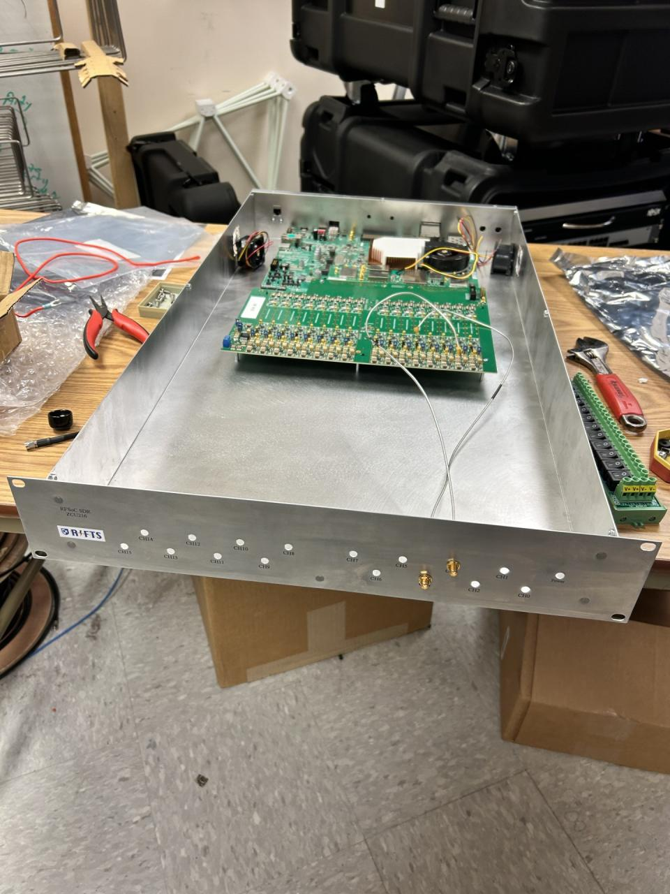

# RIFTS Hardware Repository



## Overview

This repository contains the mechanical design archive and documentation for the **Radio Interferometer For Thunderstorm Studies (RIFTS)** project at the University of New Hampshire.

The archive preserves the mechanical engineering work completed for the RIFTS hardware platforms, including enclosure designs, supporting components, CAD models, manufacturing files, validation testing, and engineering documentation.

The goal of this repository is to provide a clear and maintainable reference for future development, hardware reproduction, and continued project support.

---

## Hardware Platforms

### RFSoC 4x2 Portable Field Enclosure

The RFSoC 4x2 enclosure was developed as a portable, field-deployable hardware platform for mobile lightning measurement campaigns.

The enclosure provides:

- Portable field deployment capability
- Aluminum mechanical protection
- Electromagnetic shielding considerations
- Active thermal management
- Interface accessibility for RFSoC hardware
- Integration of custom RF pathway components

[View RFSoC 4x2 Documentation →](hardware/rfsoc-4x2/README.md)

### ZCU216 Rack-Mount Enclosure

The ZCU216 enclosure was the original RIFTS hardware enclosure platform.

Designed as a 2U rack-mounted laboratory system, it provides mechanical integration for:

- AMD Xilinx ZCU216 RFSoC development platform
- MIT Haystack RF Interface Board
- Associated RF hardware

The enclosure established the mechanical design approach later adapted for portable field hardware.

[View ZCU216 Documentation →](hardware/zcu216/README.md)

---

## Additional Hardware

### Hardware Accessories

Supporting mechanical components developed for the RIFTS hardware platforms.

Accessories include both shared and platform-specific designs:

- Cooling air ducts for ZCU216 and RFSoC 4x2 enclosure thermal management
- RFSoC 4x2 TPU corner protection pads
- RFSoC 4x2 RF pathway mechanical CAD model
- Additional integration hardware

[View Hardware Accessories →](hardware/accessories/README.md)

### OmniLOG Antenna Mounts

Weather-resistant antenna mounting hardware designed for field deployment of OmniLOG antennas.

Features:

- FDM-manufactured components
- Weather-resistant materials
- Integrated sealing features
- Field deployment considerations

[View Antenna Mount Documentation →](antenna-mounts/README.md)

---

## Electronics Reference Models

This repository includes mechanical CAD models of electronic hardware used throughout RIFTS platform development.

These models were collected or created to support:

- Mechanical enclosure design
- Board integration studies
- Connector placement verification
- Internal packaging development
- Hardware visualization

The archive includes both original and simplified CAD models where applicable. Simplified models remove unnecessary internal or cosmetic geometry while preserving:

- Board dimensions
- Mounting locations
- Connector locations
- Mechanically relevant interfaces

[View Electronics Reference Models →](electronics-reference-models.md)

---

## Included Board Models

### AMD Xilinx ZCU216 RFSoC Development Platform

**Source:** Purchased from a third-party PCB CAD modeling service

**Notes:**
- Purchased CAD model cost approximately $30
- Used for mechanical integration within the ZCU216 enclosure

**File:** `AMD_Xilinx_ZCU216_Board.SLDPRT`

### AMD Xilinx RFSoC 4x2 Development Platform

**Source:** Provided directly by an AMD representative via email

**Notes:**
- Original CAD model supplied free of charge
- Simplified version created internally for improved SolidWorks performance

**Files:**
- `AMD_Xilinx_RFSoC_4x2_Board.SLDPRT`
- `AMD_Xilinx_RFSoC_4x2_Board_Simplified.SLDPRT`

### MIT Haystack RF Interface Board

**Source:** Provided by a member of the MIT Haystack Observatory team

**Notes:**
- Simplified model created internally by removing unnecessary bodies while preserving mechanically relevant geometry

**Files:**
- `MIT_Haystack_RF_Interface_Board.SLDPRT`
- `MIT_Haystack_RF_Interface_Board_Simplified.SLDPRT`

### SparkFun ZED-F9T GNSS Timing Breakout

**Source:** Converted from manufacturer Eagle CAD files using KiCad

**Notes:**
- Board footprint model only
- No component-level geometry included

**File:** `SparkFun_ZED-F9T.SLDPRT`

### SparkFun ESP32 WROOM Thing Plus

**Source:** Converted from manufacturer Eagle CAD files using KiCad

**Notes:**
- Board footprint model only
- No component-level geometry included

**File:** `SparkFun_ESP32_WROOM.SLDPRT`

---

## Repository Structure

```
RIFTS-Hardware/
├── hardware/
│   ├── rfsoc-4x2/
│   ├── zcu216/
│   └── accessories/
│       ├── cooling-air-ducts/
│       ├── rfsoc-4x2-corner-pads/
│       └── rfsoc-4x2-rf-pathway/
├── antenna-mounts/
├── electronics-reference-models/
├── docs/
├── images/
└── downloads/
```

---

## Documentation

Each hardware section contains:

- Design overview
- Engineering rationale
- CAD model information
- Manufacturing notes
- Testing and validation documentation
- Revision history
- Associated documentation

---

## CAD and Manufacturing Files

Large CAD assemblies and manufacturing archives may be maintained separately from this repository due to file size limitations.

The repository documentation provides navigation and engineering context for all archived hardware files.

---

## Acknowledgements

This hardware was developed as part of the **Radio Interferometer For Thunderstorm Studies (RIFTS)** project at the University of New Hampshire.

Additional hardware contributions and reference designs include:

- **Frank Lind, MIT Haystack Observatory** — RF Interface Board reference design
- **AMD Xilinx** — ZCU216 RFSoC Development Platform, RFSoC 4x2 Development Platform
- **SparkFun Electronics** — ZED-F9T GNSS Timing Breakout, ESP32 WROOM Thing Plus

---

## Maintainer

Mechanical design and documentation: **Joshua D'Addario**

---

## Revision History

| Revision | Date | Description |
|----------|------|-------------|
| Rev A | July 2026 | Initial RIFTS hardware documentation archive. |