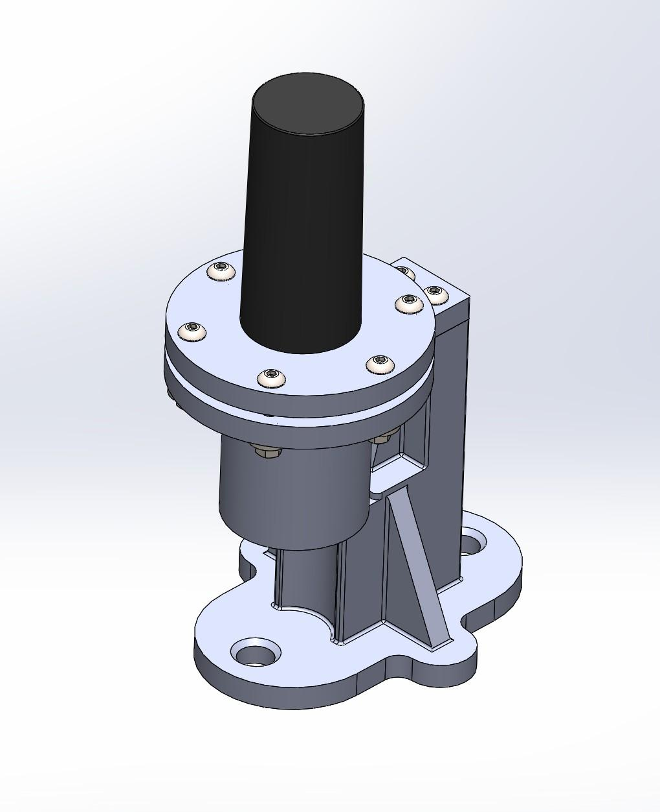
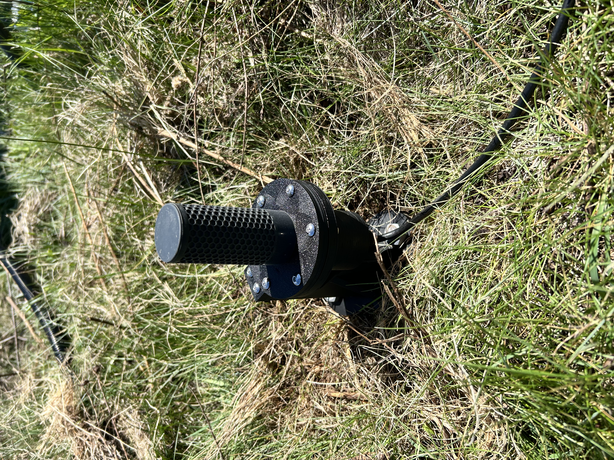
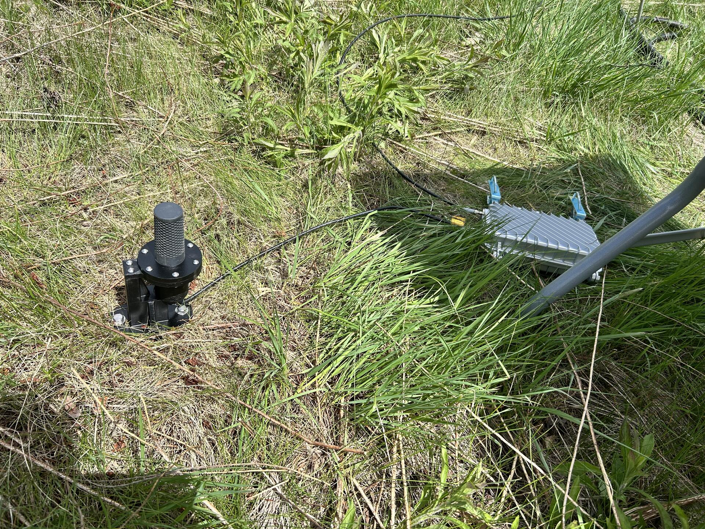

# OmniLOG PRO 1030 N Antenna Mount System



## Overview

The OmniLOG PRO 1030 N Antenna Mount System was developed as a rugged, field-deployable mounting solution for the RIFTS lightning observation platform.

The mount was designed to support outdoor deployment of the **Aaronia AG OmniLOG PRO 1030 N** antenna while addressing several challenges associated with field measurements, including environmental protection, mechanical stability, and electromagnetic interference from nearby structures.

Unlike conventional metallic mounting hardware, this design utilizes dielectric materials to reduce unwanted electromagnetic reflections and minimize potential multipath effects near the antenna.

---

## Design Requirements

The antenna mount was designed to satisfy the following requirements:

- Provide a stable ground-mounted platform for field deployment
- Protect antenna connections and electronics from environmental exposure
- Minimize electromagnetic interference from the mounting structure
- Support repeated deployment and transportation
- Allow rapid field installation and removal
- Maintain a serviceable and modular mechanical design

---

## Electromagnetic Design Considerations

A key design consideration was reducing unwanted electromagnetic interactions between the antenna mounting structure and incoming RF signals.

Traditional metallic mounting structures can introduce additional reflections and scattering near an antenna, potentially impacting measurements through multipath effects.

To mitigate this concern, the mount was designed using dielectric materials rather than metal structural components.

The resulting design provides mechanical support while reducing the likelihood of introducing additional RF scattering sources near the antenna.

---

## Mechanical Design

The antenna mount consists of three primary printed components:

1. **Top Lid**
2. **Cylindrical Housing**
3. **Ground Mounting Mast**

---

### Top Lid

The top lid provides the mechanical interface for the OmniLOG PRO 1030 N antenna.

Features include:

- Central antenna stem pass-through
- Threaded antenna retention interface
- Integrated O-ring sealing groove
- Mechanical interface to the cylindrical housing

The antenna is secured through the lid using the threaded antenna stem and retaining hardware.

---

### Cylindrical Housing

The cylindrical housing contains the antenna electronic stem and provides environmental protection.

The lid-to-body interface is sealed using:

- Commercial nitrile rubber O-ring
- Silicone grease for improved sealing and seating
- Six M5 stainless steel fasteners with washers and nuts

The bottom of the housing incorporates an opening for an M16L waterproof cable gland, allowing protected cable routing while maintaining environmental sealing.

---

### Ground Mounting Mast

The mounting mast provides the interface between the antenna enclosure and the ground anchoring system.

Features include:

- Two mounting holes for ground stakes
- Load distribution washers
- Two M5 heat-set inserts for attaching the cylindrical housing

The final field deployment configuration uses approximately 16-inch ground stakes driven into the surrounding terrain.

---

## Environmental Sealing

The enclosure was designed for outdoor operation and underwent water immersion testing.

The final sealing system uses:

- Commercial nitrile rubber O-ring
- Silicone grease applied to sealing surfaces
- M16L waterproof cable gland

Early prototypes evaluated custom TPU printed O-rings. While functional, printed TPU seals did not provide the desired sealing performance, leading to the adoption of commercially manufactured elastomer seals.

For colder operating environments, silicone O-rings are planned as a future improvement due to their improved low-temperature flexibility.

---

## Design Evolution

The antenna mount geometry remained consistent throughout development while materials were evaluated for performance and field suitability.

| Version | Material | Purpose |
|---------|----------|---------|
| Prototype | PLA | Initial geometry verification and rapid iteration |
| Field Evaluation | ABS + UV-resistant coating | Outdoor testing and deployment evaluation |
| Final Production Design | ASA-CF | Planned long-term field deployment |

All versions were manufactured using a **Bambu Lab A1** FDM printer.

Bambu Lab filament materials were used throughout development.

Two ABS prototypes are currently deployed in the field for continued evaluation. The final ASA-CF production units have not yet been manufactured.

---

## Manufacturing Overview

The antenna mount was manufactured using fused deposition modeling (FDM) additive manufacturing.

The validated manufacturing package includes:

- Native CAD files
- STL files
- Bambu Studio project files (`.3mf`)
- Documented slicer settings

Detailed manufacturing information is available in:

- [Print Settings](Manufacturing/Print_Settings.md)
- [Bill of Materials](Manufacturing/BOM.md)

---

## Field Deployment

The antenna mount was designed for deployment in outdoor environments.

Installation procedure:

1. Drive ground stakes through the mounting mast into the deployment surface.
2. Attach the cylindrical housing to the mast using the integrated M5 mounting interface.
3. Install the antenna into the top lid.
4. Verify O-ring placement and sealing surfaces.
5. Secure the lid to the cylindrical housing.
6. Connect required antenna cabling through the waterproof cable gland.

---

## Testing

### Water Immersion Testing

A custom water immersion test fixture was designed and fabricated to evaluate enclosure sealing.

The fixture consisted of:

- 5-inch diameter PVC pipe
- 1-meter length
- PVC end cap
- Custom 3D printed PLA support structure

The antenna mount successfully demonstrated water resistance consistent with an IPX7-style immersion test.

The PVC test fixture itself exhibits minor leakage after several hours; however, this did not prevent evaluation of the antenna mount sealing performance.

Formal dust ingress testing was not performed; therefore, no dust protection rating is claimed.

Detailed testing documentation is available in:

[Water Immersion Test](Testing/Water_Immersion_Test.md)

---

## Gallery

### CAD Assembly


CAD model of the complete antenna mounting system.

---

### Deployed System



Antenna mount deployed during field testing.

---

### Additional Field Photos



Field deployment configuration alongside neighboring instrumentation.

---

### Waterproof Testing


Custom immersion testing setup.

---

## File Organization

```text
antenna-mounts/

├── CAD/
│   ├── SLDPRT/
│   └── STEP/
│
├── Manufacturing/
│   ├── STL/
│   ├── Bambu_Studio/
│   └── Print_Settings.md
│
├── Documentation/
│   └── Drawing.pdf
│
├── Testing/
│   ├── Water_Immersion_Test.md
│   └── immersion_test.jpg
│
└── README.md
```

---

## Revision History

| Revision | Date | Description |
|----------|------|-------------|
| Rev A | July 2026 | Initial antenna mount documentation and archive release. |

---

## Credits

Mechanical design, fabrication, testing, and documentation:

**Joshua D'Addario**