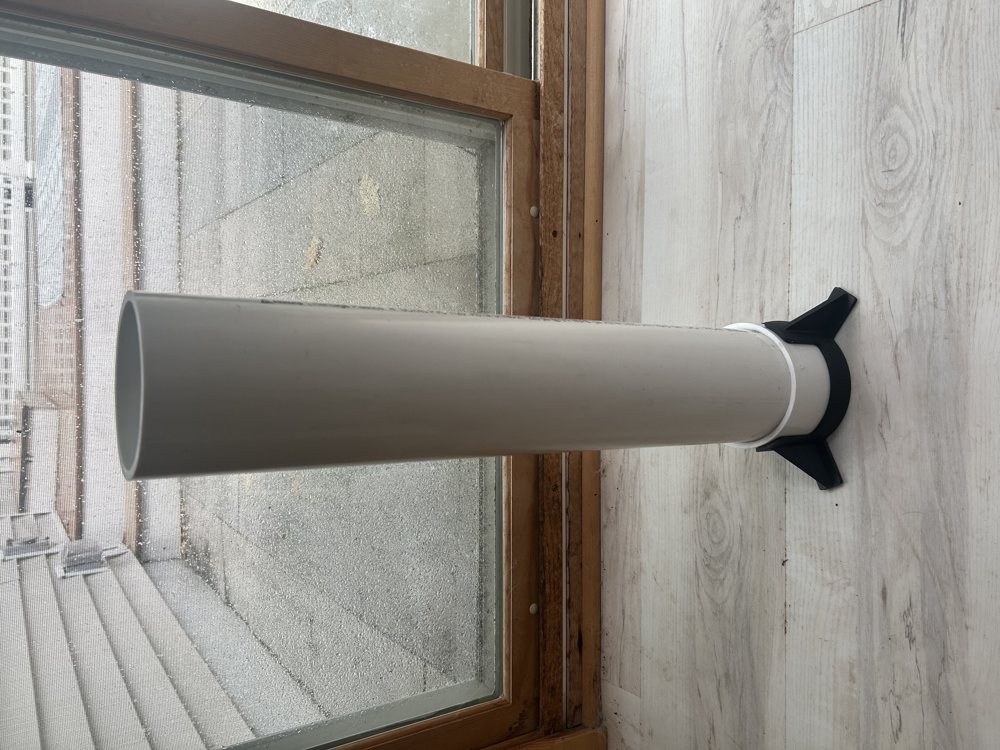
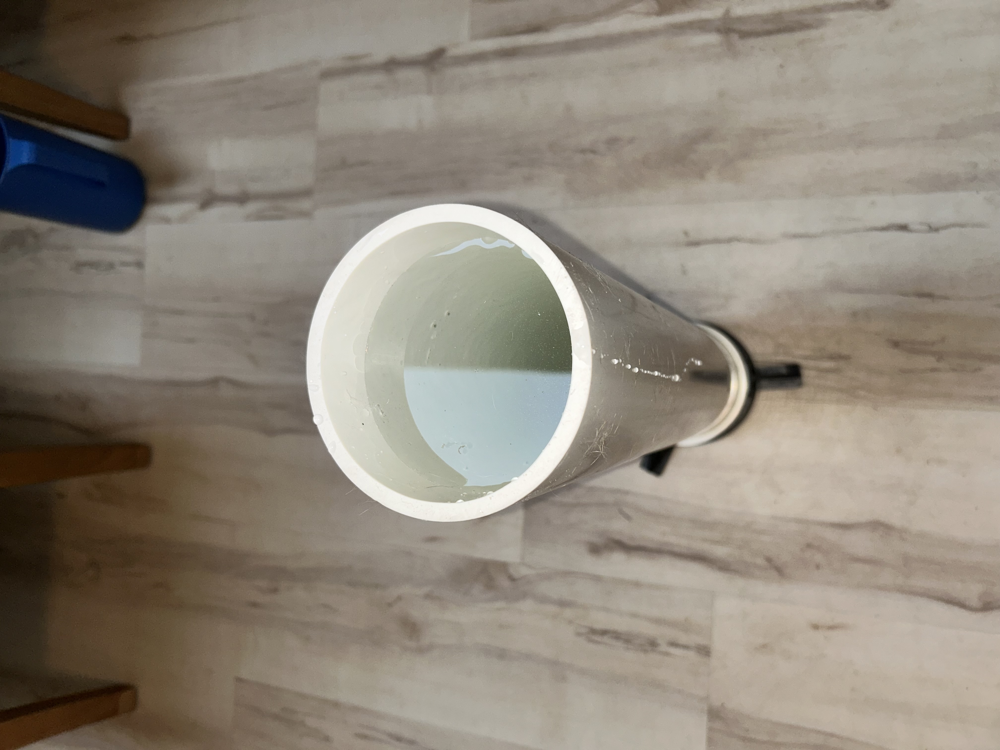
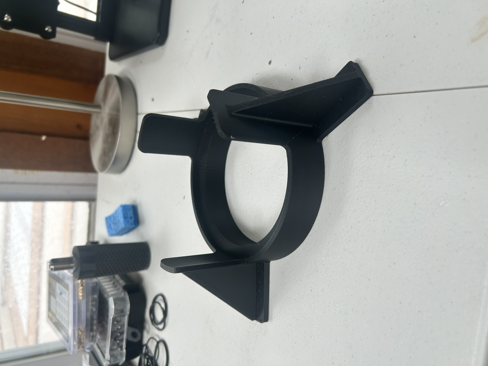
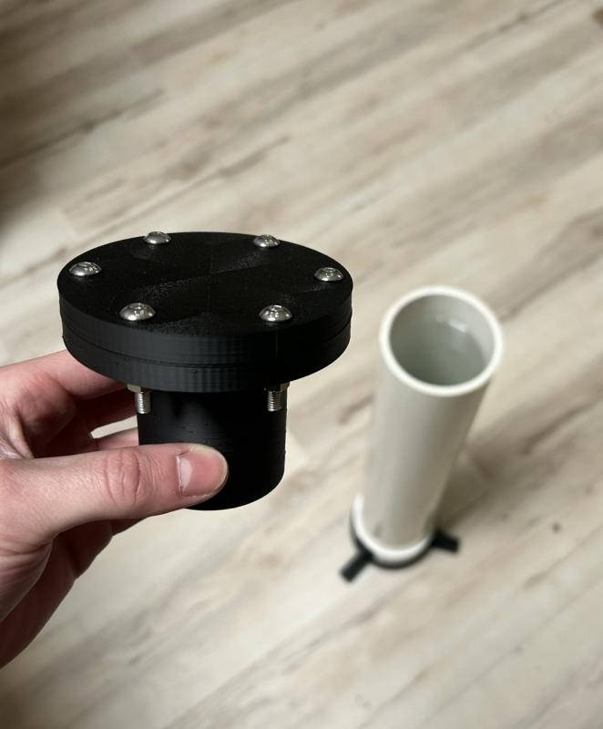
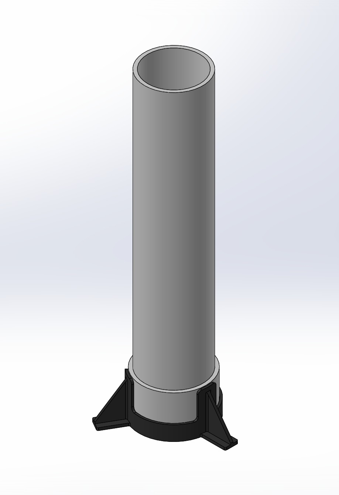

# Water Immersion Test Fixture



---

# Project Summary

| | |
|---|---|
| **Project** | Water Immersion Test Fixture |
| **Purpose** | Environmental sealing validation for OmniLOG PRO 1030 N antenna mount |
| **Associated Hardware** | OmniLOG PRO 1030 N Antenna Mount System |
| **Test Type** | Engineering immersion validation |
| **Water Column Height** | Approximately 1 meter |
| **Primary Materials** | PVC + PLA |
| **Manufacturing Method** | FDM Additive Manufacturing |
| **Printer** | Bambu Lab A1 |
| **Filament** | Bambu PLA Basic |
| **Status** | Complete |

---

# Overview

The Water Immersion Test Fixture was developed to evaluate the environmental sealing performance of the OmniLOG PRO 1030 N Antenna Mount System.

The fixture provides a simple, low-cost method of performing repeatable immersion testing using commercially available PVC components and a custom-designed 3D printed support structure.

Although originally developed to validate the antenna mount enclosure, the fixture may also support future environmental testing of other laboratory hardware.

---

# Test Objective

The primary objective of this evaluation was to verify the performance of the antenna mount sealing system.

The test specifically evaluated:

- 50 mm × 3.5 mm nitrile rubber O-ring.
- M16L waterproof cable gland.
- Overall enclosure sealing strategy.

The antenna mount successfully demonstrated water resistance consistent with the conditions of an IPX7-style immersion test.

Formal IP certification was **not performed**.

---

# Test Fixture Design

The immersion fixture consists of:

| Component | Description |
|---|---|
| PVC Pipe | 5 inch diameter PVC pipe |
| Water Column | Approximately 1 meter tall |
| End Cap | Standard PVC end cap |
| Base | Custom PLA printed support structure |

The custom printed base supports the PVC column during filling and testing while reducing the likelihood of accidental tipping.

---

# Design Rationale

Commercial waterproof testing equipment was not available during development.

Instead, a simple immersion fixture was designed that could:

- Be manufactured inexpensively.
- Use commercially available PVC components.
- Support repeatable testing.
- Be reproduced easily by future lab members.

The resulting fixture provides a practical validation tool requiring only one custom printed component.

---

# Test Procedure

The antenna mount assembly was prepared according to the documented assembly procedure.

Testing consisted of:

1. Installing the antenna mount sealing components.
2. Filling the PVC water column.
3. Submerging the antenna mount assembly.
4. Maintaining immersion during evaluation.
5. Inspecting the enclosure interior for evidence of water ingress.

---

# Results

The antenna mount successfully demonstrated water resistance throughout testing.

No significant water ingress into the sealed electronics chamber was observed.

The sealing system consisting of the nitrile rubber O-ring, Molykote 111 silicone grease, and M16L cable gland performed as intended.

---

# Limitations

This evaluation represents an engineering validation test rather than a formal certification.

The following limitations should be noted:

- Formal IP certification was not performed.
- Dust ingress testing was not conducted.
- Pressure testing beyond the approximately 1 meter water column was not performed.
- The PVC fixture itself develops minor leakage after several hours.

The observed leakage originated from the test fixture rather than the antenna mount under evaluation and did not prevent validation of the sealing system.

---

# Gallery

## Complete Test Fixture


Complete water immersion test fixture.

---

## Water Surface



Water column during immersion testing.

---

## Test Fixture Base



Custom PLA printed support structure.

---

## Antenna Mount During Testing



Antenna mount undergoing immersion testing.

---

## CAD Model



CAD model of the complete water immersion fixture.

---

# Engineering Notes

The Water Immersion Test Fixture was developed as a practical engineering validation tool rather than a standardized testing apparatus.

## Fixture Stability

The custom PLA support base provides adequate stability for normal operation; however, the fixture should always be placed on a flat, level surface before filling.

Once filled, the water column becomes significantly heavier and should not be moved.

---

## Fixture Leakage

Minor leakage may develop from the PVC water column after several hours.

This leakage originates from the fixture itself rather than the antenna mount being evaluated.

For extended tests, placing a towel or shallow catch pan beneath the fixture is recommended.

---

## Test Repeatability

For consistent results, inspect the following before each test:

- O-ring condition.
- O-ring cleanliness.
- Cable gland tightness.
- Fastener tightness.
- Proper seating of all sealing surfaces.

The antenna mount should always be assembled using the documented tightening sequence to ensure uniform O-ring compression.

---

## Fixture Reproducibility

The fixture was intentionally designed around standard 5-inch PVC components that can be sourced from most hardware stores.

Only the support base requires custom fabrication, allowing damaged or worn components to be replaced individually without reproducing the entire fixture.

---

# Lessons Learned

Development of the Water Immersion Test Fixture yielded several observations that informed the final antenna mount design:

- Commercial nitrile rubber O-rings provided significantly more consistent sealing performance than earlier TPU printed O-rings.
- Applying only a light coating of Molykote 111 silicone grease improved O-ring seating while avoiding excessive lubricant buildup.
- A simple PVC-based immersion fixture proved to be an effective and inexpensive alternative to specialized waterproof testing equipment.
- Designing around commercially available hardware minimized cost while improving future reproducibility.

---

# File Organization

```text
Water_Immersion_Test/

├── CAD/
│   ├── SLDPRT/
│   │   ├── 5in_PVC.SLDPRT
│   │   └── water_column_base.SLDPRT
│   │
│   ├── SLDASM/
│   │   └── Water_Tower_Assembly.SLDASM
│   │
│   └── STEP/
│       ├── 5in_PVC.STEP
│       ├── water_column_base.STEP
│       └── Water_Tower_Assembly.STEP
│
├── Manufacturing/
│   ├── STL/
│   │   └── water_column_base.STL
│   │
│   └── Bambu_Studio/
│       └── water_column_base.3mf
│
├── Images/
│   ├── full_assembly.jpg
│   ├── surface_of_water_view.jpg
│   ├── base.jpg
│   ├── immersion_test.jpg
│   └── CAD.jpg
│
└── README.md
```

---

# Available Files

## Native CAD

- `Water_Tower_Assembly.SLDASM`
- `5in_PVC.SLDPRT`
- `water_column_base.SLDPRT`

---

## STEP Exports

- `Water_Tower_Assembly.STEP`
- `5in_PVC.STEP`
- `water_column_base.STEP`

---

## Manufacturing Files

- `water_column_base.STL`
- `water_column_base.3mf`

---

# Future Improvements

Potential future enhancements include:

- Permanent depth markings on the water column.
- Improved PVC joint sealing.
- Integrated drain valve.
- Transparent water column for improved observation.
- Pressure instrumentation for quantitative leak testing.
- Longer-duration immersion testing.
- Formal dust ingress testing.
- Evaluation of future antenna mount revisions.

---

# Engineering Archive Philosophy

This fixture is included in the repository not only to document antenna mount validation, but also to preserve the engineering process behind the testing methodology.

Future researchers are encouraged to document:

- Design changes.
- Manufacturing improvements.
- Validation results.
- Lessons learned.

The goal of this archive is to preserve both the final hardware designs and the reasoning, testing, and practical experience that produced them.

---

# Related Documentation

- [OmniLOG PRO 1030 N Antenna Mount](../../README.md)
- [Print Settings](../../Manufacturing/Print_Settings.md)
- [Bill of Materials](../../Manufacturing/BOM.md)