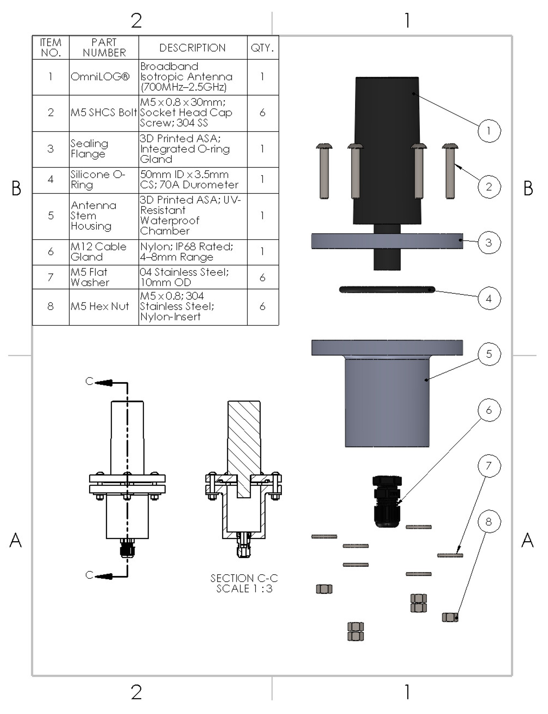
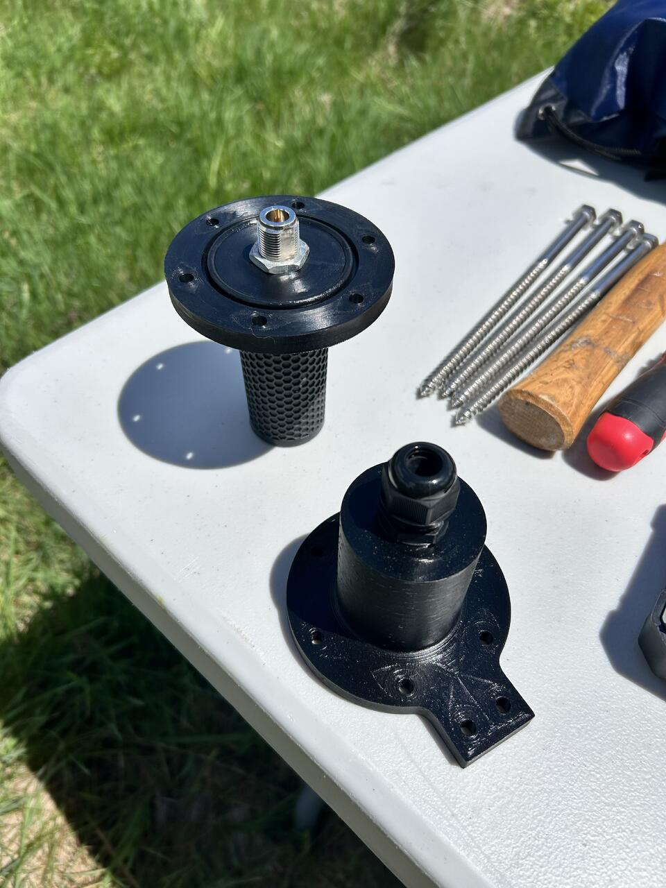
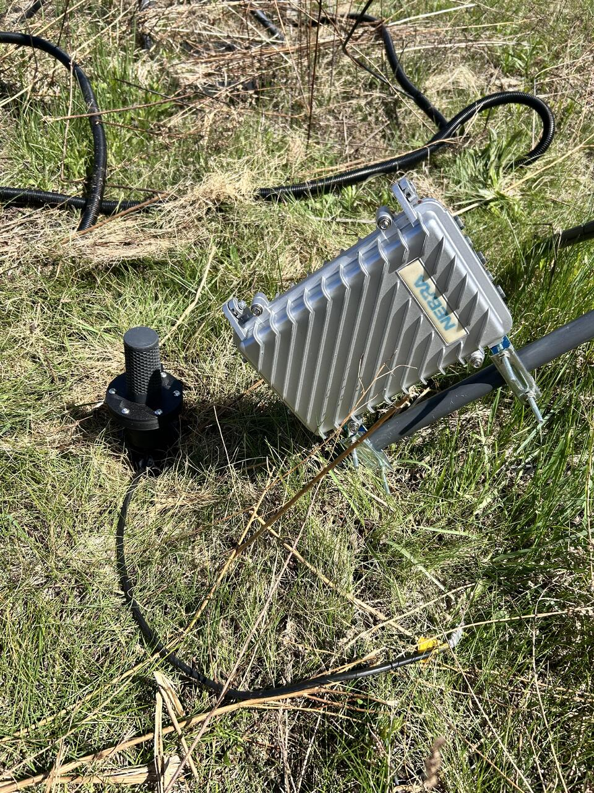
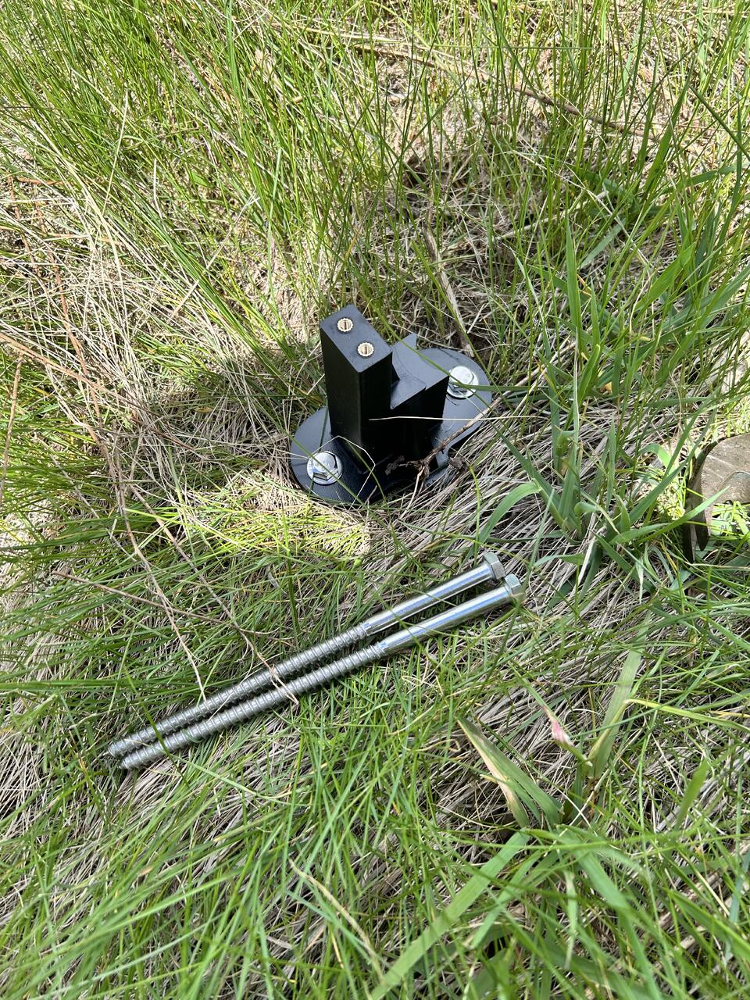

# Gallery

Click any photo below to open it full-size. Use the arrow keys or on-screen arrows to page through the rest of that section without returning to this page.

---

## CAD & Engineering

{: class="stack-item" style="--tx:0px; --htx:0px; --rot:-4deg; --z:5;" data-gallery="cad-engineering" }

{: class="stack-item" style="--tx:14px; --htx:60px; --rot:3deg; --z:4;" data-gallery="cad-engineering" }

*CAD model of the complete antenna mounting system, and the manufacturing drawing of the Top Lid × Cylindrical Housing assembly (exploded view, cross-section, and bill of materials).*

---

## Field Deployment

{: class="stack-item" style="--tx:0px; --htx:0px; --rot:-4deg; --z:5;" data-gallery="field-deployment" }

{: class="stack-item" style="--tx:14px; --htx:60px; --rot:3deg; --z:4;" data-gallery="field-deployment" }

{: class="stack-item" style="--tx:28px; --htx:120px; --rot:-5deg; --z:3;" data-gallery="field-deployment" }

{: class="stack-item" style="--tx:42px; --htx:180px; --rot:4deg; --z:2;" data-gallery="field-deployment" }

{: class="stack-item" style="--tx:56px; --htx:240px; --rot:-3deg; --z:1;" data-gallery="field-deployment" }

*Antenna mount being assembled during field testing, and the field deployment configuration alongside neighboring instrumentation.*

---

## Waterproof Testing

{: class="stack-item" style="--tx:0px; --htx:0px; --rot:-4deg; --z:5;" data-gallery="waterproof-testing" }

*Custom immersion testing setup.*