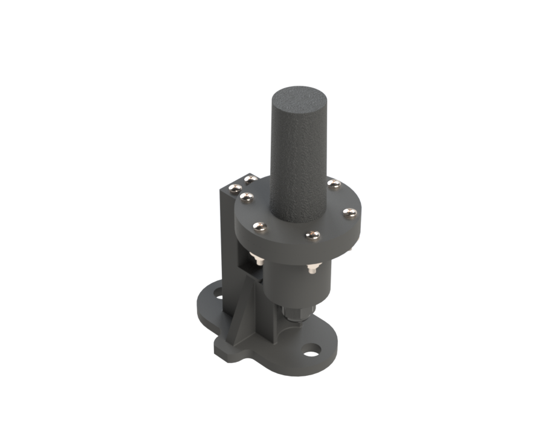
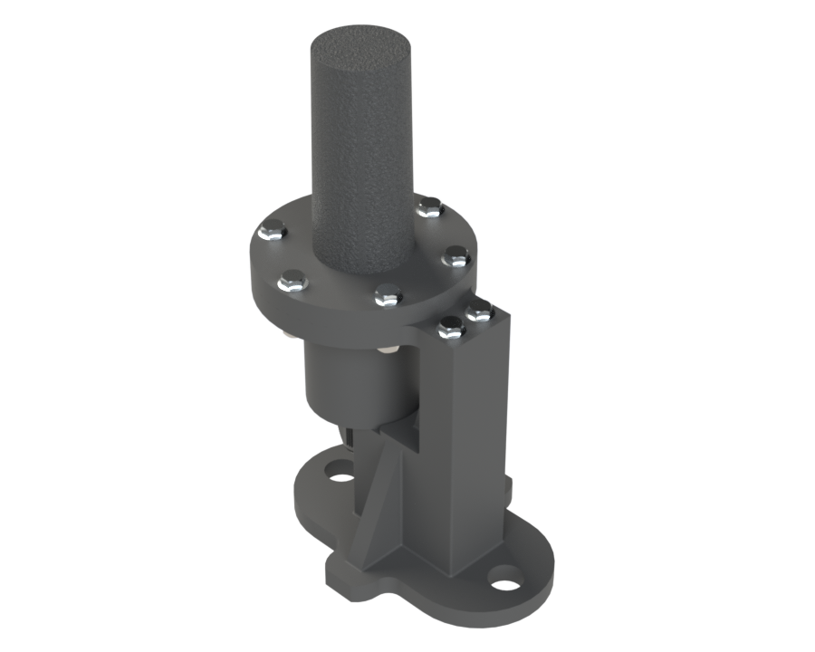
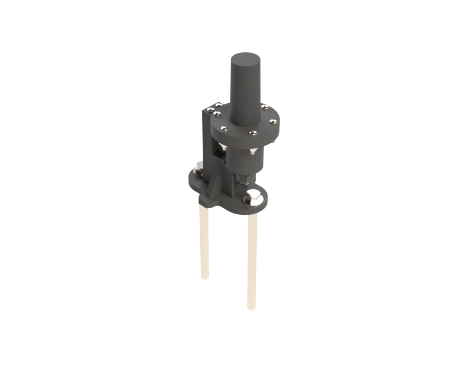
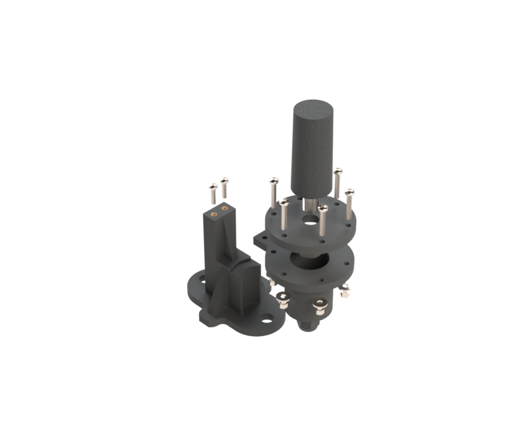

# OmniLOG PRO 1030 N Antenna Mount System

## Project Summary

| | |
|---|---|
| **Project** | OmniLOG PRO 1030 N Antenna Mount System |
| **Purpose** | Weather-resistant dielectric mounting system for field deployment of the Aaronia OmniLOG PRO 1030 N antenna |
| **Platform** | Aaronia OmniLOG PRO 1030 N |
| **Application** | Radio Interferometer for Thunderstorm Studies (RIFTS) |
| **Manufacturing Method** | FDM Additive Manufacturing |
| **Primary Material** | ASA-CF |
| **Prototype Materials** | PLA, TPU, ABS |
| **Environmental Sealing** | 50 mm ID × 3.5 mm CS O-ring, silicone grease, M16L waterproof cable gland, 12 wall loops on printed components to resist moisture migration through layer lines |
| **Validation Testing** | Water immersion testing consistent with IPX7-style conditions (not formally certified) |
| **Electromagnetic Design** | Dielectric construction to minimize RF scattering and reduce susceptibility to multipath effects |
| **Status** | Final Design Complete |
| **Related Hardware** | Water Immersion Test Fixture |

---

## HD Renders 

{: data-gallery="antenna-renders" }

{: data-gallery="antenna-renders" }

{: data-gallery="antenna-renders" }

{: data-gallery="antenna-renders" }

<!-- Scroll strip — add more renders by appending additional image lines above, same pattern. -->

---

## Overview

The OmniLOG PRO 1030 N Antenna Mount System was developed as a rugged, field-deployable mounting solution for the RIFTS lightning observation platform.

The mount was designed to support outdoor deployment of the **Aaronia AG OmniLOG PRO 1030 N** antenna while addressing several challenges associated with field measurements, including environmental protection, mechanical stability, and electromagnetic interference from nearby structures.

Unlike conventional metallic mounting hardware, this design utilizes dielectric materials to reduce unwanted electromagnetic reflections and minimize potential multipath effects near the antenna.

---

## Design Requirements

The antenna mount was designed to satisfy the following requirements:

- Provide a stable ground-mounted platform for field deployment
- Protect antenna connections and electronics from environmental exposure
- Minimize electromagnetic interference from the mounting structure
- Support repeated deployment and transportation
- Allow rapid field installation and removal
- Maintain a serviceable and modular mechanical design

---

## Electromagnetic Design Considerations

A key design consideration was reducing unwanted electromagnetic interactions between the antenna mounting structure and incoming RF signals.

Traditional metallic mounting structures can introduce additional reflections and scattering near an antenna, potentially affecting measurements through multipath effects. To mitigate this concern, the mount was designed using dielectric materials rather than metal structural components, minimizing the likelihood of the mounting hardware acting as an unintended RF scatterer.

The mounting system was also designed to position the antenna approximately 1.5 feet lower than the original mounting configuration. By reducing the antenna height above the ground, the design sought to decrease the path length difference between direct and ground-reflected signals, helping to mitigate multipath effects arising from ground reflections during field measurements.

The resulting design provides a mechanically robust mounting solution while reducing potential sources of RF scattering and multipath that could influence measurement quality.

---

## Mechanical Design

The antenna mount consists of three primary printed components:

1. **Top Lid**
2. **Cylindrical Housing**
3. **Ground Mounting Mast**

### Top Lid

The top lid provides the mechanical interface for the OmniLOG PRO 1030 N antenna. Features include:

- Central antenna stem pass-through
- Threaded antenna retention interface
- Integrated O-ring sealing groove
- Mechanical interface to the cylindrical housing

The antenna is secured through the lid using the threaded antenna stem and retaining hardware.

### Cylindrical Housing

The cylindrical housing contains the antenna electronic stem and provides environmental protection, sealed against the top lid and fitted with a waterproof cable entry point. Full sealing hardware and specifications are detailed under Environmental Sealing below.

### Ground Mounting Mast

The mounting mast provides the interface between the antenna enclosure and the ground anchoring system. Features include:

- Two mounting holes for ground stakes
- Two M5 heat-set inserts for attaching the cylindrical housing
- Integrated seat that supports the base of the cylindrical housing, requiring no additional fasteners

The final field deployment configuration uses 8-inch ground stakes driven into the surrounding terrain.

---

## Environmental Sealing

The enclosure was designed for outdoor operation and underwent water immersion testing. Environmental sealing is achieved through two primary interfaces, supplemented by a print setting applied across all printed enclosure components: each is printed with 12 wall loops, increasing wall density and reducing the likelihood of moisture migrating inward through layer lines.

### Lid Seal

The interface between the top lid and cylindrical housing uses:

- One 50 mm × 3.5 mm (ID × CS) O-ring
- Molykote 111 silicone grease, applied lightly to the O-ring
- Stainless steel M5 hardware

The O-ring provides the primary environmental barrier between the lid and cylindrical housing. Only a light coating of silicone grease is required — its purpose is to improve seating and sealing performance, not to fill the O-ring groove, so excess grease should be avoided.

Early prototypes evaluated custom TPU-printed O-rings which did not provide the desired sealing performance, leading to the adoption of a commercially manufactured nitrile rubber O-ring for validation testing. The nitrile O-ring was selected for the prototype and testing phases due to its availability and reliable performance.

For long-term outdoor deployment, silicone remains the preferred O-ring material for this application, given its superior low-temperature flexibility. However, a silicone O-ring matching the required dimensions (50 mm ID × 3.5 mm CS) could not be readily sourced. A **fluoroelastomer (FKM)** O-ring of the same size, rated to −15 °F, was identified as a practical substitute — it should perform adequately for outdoor use through New England winters, though silicone would still be the superior choice if a matching size becomes available. See the **Manufacturing Details** page for the specific sourced part and commercial link.

### Cable Entry Seal

Cable routing is provided through one M16L waterproof cable gland, which prevents water and debris ingress through the lower enclosure interface while allowing antenna cabling to exit the sealed chamber.

The internal locking nut of the cable gland must be tightened from inside the cylindrical housing interface — a long socket wrench or sufficiently narrow access tool may be required due to the confined geometry.

For validation results, see Water Immersion Testing below.

---

## Design Evolution

The top lid and cylindrical housing were the last components to reach their final geometry, and once finalized, went largely unchanged for the remainder of development aside from one earlier iteration. The ground mounting structure took a very different path: many wholly different design concepts were made and evaluated for the ground mount before settling on the current mast geometry. Independent of geometry, materials were evaluated throughout development for performance and field suitability.

| Version | Material | Purpose |
|---------|----------|---------|
| Prototype | PLA | Initial geometry verification and rapid iteration |
| Field Evaluation | ABS + UV-resistant coating | Outdoor testing and deployment evaluation |
| Final Production Design | ASA-CF | Planned long-term field deployment |

All versions were manufactured using a Bambu Lab A1 FDM printer, using Bambu Lab filament materials throughout development.

Two ABS prototypes are currently deployed in the field for continued evaluation. The final ASA-CF production units have not yet been manufactured.

---

## Manufacturing

The antenna mount was manufactured using fused deposition modeling (FDM) additive manufacturing. The validated manufacturing package includes native CAD files, STL files, Bambu Studio project files (`.3mf`), and documented slicer settings — including the 12-wall-loop setting used to help resist moisture ingress (see Environmental Sealing above).

For detailed printer parameters, orientation rationale, structural settings, and the full bill of materials, see the **Manufacturing Details** page.

---

## Assembly Procedure

### Installation Video

<video controls>
  <source src="../../Antenna_Mount_Installation_Tutorial.mp4" type="video/mp4">
  Your browser does not support the video tag.
</video>

SolidWorks assembly walkthrough covering the full sequence below — O-ring installation through final housing attachment. Refer to the written steps for reference while assembling.
{: .video-caption }

<!-- TODO: confirm final video filename/path once uploaded -->

!!! warning "Cable routing not shown in video"
    Step 4 (Route Antenna Cable) was omitted from the video — the cable routing looked visually awkward in the SolidWorks animation, so it was left out. **Don't skip this step during actual assembly**: the cable must be routed through the cable gland, into the cylindrical housing, and up to the base of the antenna stem before sealing the top lid to the housing. See the written steps below for the full sequence.

### Written Steps

The recommended assembly sequence is:

**1. Install O-ring** — Lightly coat the 50 mm × 3.5 mm O-ring with silicone grease and install it into the sealing groove on the top lid. Only a minimal amount of grease is required.

**2. Install Antenna** — Secure the antenna to the top lid using the retaining hardware supplied with the antenna. The antenna should be fully secured before continuing assembly.

**3. Install Cable Gland** — Install the M16L cable gland into the cylindrical housing. Using a long socket wrench or narrow access tool, tighten the internal locking nut from inside the housing.

**4. Route Antenna Cable** — Route the cable from the neighboring electronics enclosure through the cable gland and into the cylindrical housing. The cable should exit through the top of the housing and connect to the base of the antenna stem.

**5. Seal Top Lid to Housing** — Join the top lid and cylindrical housing using the six M5 fasteners, tightening the nuts in a star pattern to ensure even O-ring compression and consistent sealing pressure.

**6. Install Ground Mast** — Mount the ground mast at the desired deployment location using the ground stakes before attaching the antenna housing assembly, so the mast can be secured without handling the completed antenna assembly.

**7. Attach Housing Assembly** — Attach the completed top lid and cylindrical housing assembly to the mast using the two additional M5 mounting screws installed into the mast's heat-set inserts.

The antenna mount is now successfully deployed.

---

## Water Immersion Testing

A custom water immersion test fixture was designed and fabricated to evaluate enclosure sealing. The fixture consisted of:

- 5-inch diameter PVC pipe, 1-meter length
- PVC end cap
- Custom 3D printed PLA support structure

The antenna mount successfully demonstrated water resistance consistent with an IPX7-style immersion test. The PVC test fixture itself exhibits minor leakage after several hours; however, this did not prevent evaluation of the antenna mount sealing performance.

Formal dust ingress testing was not performed; therefore, no dust protection rating is claimed.

---

## Revision History

| Revision | Date | Description |
|----------|------|--------------|
| Rev A | July 2026 | Initial antenna mount documentation and archive release. |

---

## Credits

**Mechanical Design, CAD, and Documentation**
Joshua D'Addario — University of New Hampshire, Engineering Physics

**Project Support and Technical Guidance**
Dr. Ningyu Liu — University of New Hampshire, Principal Investigator, RIFTS
Stephen Horn — University of New Hampshire, Senior Member, RIFTS Research Team

**Hardware**
Aaronia — OmniLOG PRO 1030 N