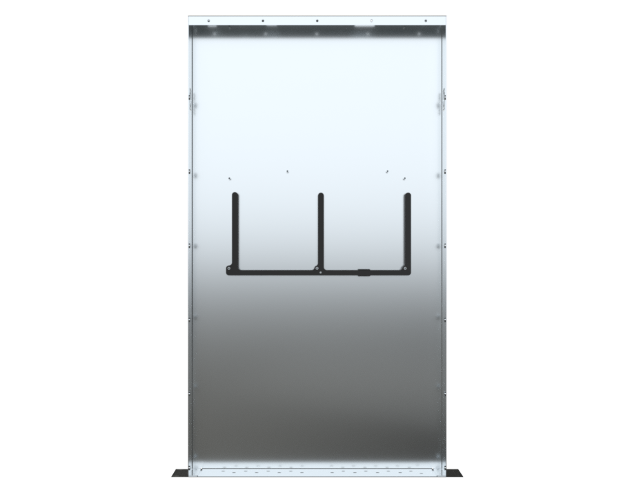
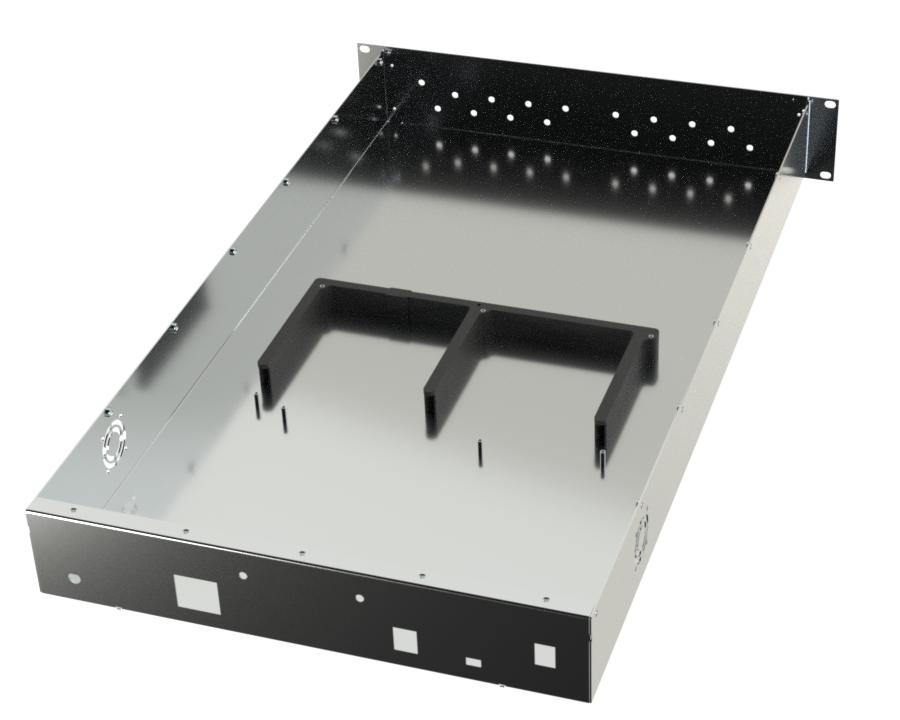

# RF Interface Board (RFIB) Support

## Project Summary

| | |
|---|---|
| **Project** | RF Interface Board (RFIB) Support |
| **Purpose** | Structural support bridging the RF Interface Board's widely spaced mounting points, while enabling internal cable routing |
| **Associated Platform** | ZCU216 RF Shielded Enclosure |
| **Manufacturing Method** | FDM Additive Manufacturing |
| **Primary Material** | PLA (as manufactured) |
| **Recommended Material** | PETG (improved thermal performance) |
| **Mounting** | Shares the RF Interface Board's existing 3 mounting standoffs |
| **Construction** | Two-piece, glued |
| **Status** | Complete |

---

## HD Renders

{: data-gallery="rfib-support-renders" }

{: data-gallery="rfib-support-renders" }

{: data-gallery="rfib-support-renders" }

{: data-gallery="rfib-support-renders" }

{: data-gallery="rfib-support-renders" }

<!-- Scroll strip — add more renders by appending additional image lines above, same pattern. -->

--- 

## Overview

The RF Interface Board (RFIB) is secured within the ZCU216 enclosure at three mounting points that are spaced relatively far apart from one another. Left unsupported across that span, the board is more susceptible to flex — a concern for a board carrying precision RF hardware.

The RFIB Support is a custom 3D-printed bracket designed to bridge these mounting points and reduce that flex, without adding any additional hardware to the enclosure — it mounts directly to the same three standoffs already used by the RFIB itself. The underside of the RFIB has several electronic component protrusions, so the support's geometry was specifically designed to clear all of them, avoiding any contact with active circuitry.

The support body is also shelled, creating internal channels that allow cabling to be routed through the structure itself rather than around it — improving overall cable management within the enclosure.

---

## Design Features

- Bridges the RFIB's three mounting points to reduce board flex across the span.
- Clears all electronic component protrusions on the underside of the RFIB.
- Shelled construction enables internal wire routing for improved cable management.
- Mounts to the RFIB's existing standoffs — no additional enclosure hardware required.
- Two-piece construction, glued together after printing.

---

## Material Selection

The support was manufactured and validated using PLA. For long-term use, **PETG is recommended** instead, given its improved thermal performance in an enclosure environment that experiences elevated temperatures during operation.

---

## Two-Piece Construction

The RFIB Support is printed as two separate pieces and glued together after printing. This split is a practical necessity rather than a design choice — the full span of the part exceeds the build volume of a Bambu Lab A1, and most desktop FDM printers share a similar size constraint. The two halves join along a mating surface designed to align accurately during assembly.

### Assembly Tutorial

<video controls style="width:100%; max-width:640px; border-radius:8px;">
  <source src="/hardware/RFIB-support/media/RFIB_Support_Assembly.mp4" type="video/mp4">
  Your browser does not support the video tag.
</video>

*SolidWorks walkthrough showing how the two printed halves of the RFIB Support align and join together.*

<!-- TODO: confirm final video filename/path once uploaded -->

!!! note "Installation shown elsewhere"
    Installation of the completed RFIB Support onto the enclosure standoffs is demonstrated within the **ZCU216 Board Installation Video**, alongside the RFIB and ZCU216 board installation — see the [ZCU216 Overview page](../zcu216/overview.md) for that video. It is not duplicated here since it's already covered as part of that walkthrough.

---

## Downloads

| Part | SolidWorks (.SLDPRT) | Neutral (.STEP) | Print-Ready (.STL) |
|---|:---:|:---:|:---:|
| Part A | [:fontawesome-solid-file-import:](media/Part_A/RIFTS_RFIB_Support_PartA.SLDPRT){: title="Download RFIB Support Piece 1 .SLDPRT" } | [:fontawesome-solid-file-import:](media/Part_A/RIFTS_RFIB_Support_PartA.STEP){: title="Download RFIB Support Piece 1 .STEP" } | [:fontawesome-solid-cube:](media/Part_A/RIFTS_RFIB_Support_PartA.STL){: title="Download RFIB Support Piece 1 .STL" } |
| Part B | [:fontawesome-solid-file-import:](media/Part_B/RIFTS_RFIB_Support_PartB.SLDPRT){: title="Download RFIB Support Piece 2 .SLDPRT" } | [:fontawesome-solid-file-import:](media/Part_B/RIFTS_RFIB_Support_PartB.STEP){: title="Download RFIB Support Piece 2 .STEP" } | [:fontawesome-solid-cube:](media/Part_B/RIFTS_RFIB_Support_PartB.STL){: title="Download RFIB Support Piece 2 .STL" } |

### Full Assembly & Print Project

[:fontawesome-solid-cubes: Download Full Assembly (.SLDASM)](media/RIFTS_RFIB_Support_Assembly.SLDASM){: .md-button :download}
[:fontawesome-solid-layer-group: Download Print Project (.3mf)](media/RIFTS_RFIB_Support_PrintAssembly.3mf){: .md-button :download}

### Notes

- The **.SLDPRT** files are native SolidWorks part files for each individual piece and require SolidWorks to open.
- The **.STEP** files are neutral-format exports compatible with most CAD software, recommended if you don't have access to SolidWorks.
- The **.STL** files are print-ready mesh geometry for slicing in any FDM slicer.
- The **.SLDASM** file represents the two pieces joined together and requires SolidWorks to open.
- The **.3mf** file is a Bambu Studio print project containing both pieces with the validated print settings and slicer profile used for production.

---

## Manufacturing

The RFIB Support was manufactured using fused deposition modeling (FDM) additive manufacturing, printed as two separate pieces and joined with adhesive after printing due to build volume constraints.

| Component | Material | Manufacturing Method |
|---|---|---|
| Support Piece 1 | PLA (PETG recommended) | FDM 3D Printing |
| Support Piece 2 | PLA (PETG recommended) | FDM 3D Printing |

---

## Related Hardware

- [ZCU216 RF Shielded Enclosure](../zcu216/overview.md) — the RFIB Support shares mounting standoffs with the RF Interface Board and is installed as part of the same board installation procedure shown on that page.

---

## Revision History

| Revision | Date | Description |
|----------|------|--------------|
| Rev A | July 2026 | Initial RFIB Support documentation and archive release. |

---

## Credits

Mechanical design and documentation: **Joshua D'Addario**