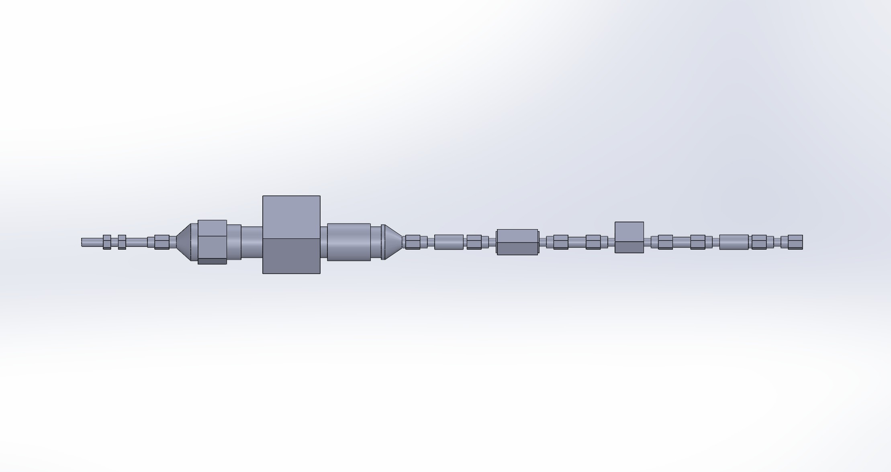
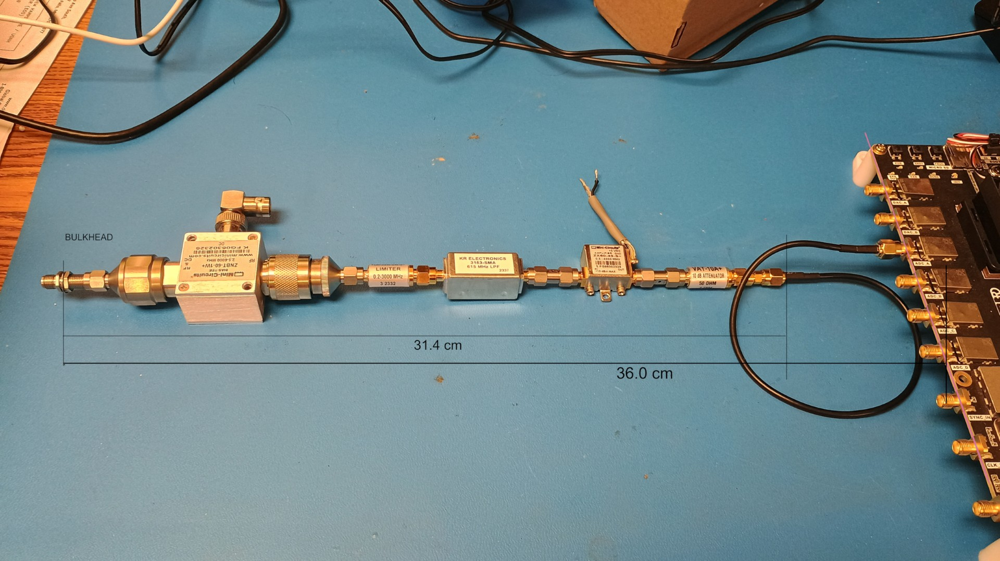

# RFSoC 4x2 RF Pathway Reference Model

## Project Summary

| | |
|---|---|
| **Project** | RFSoC 4x2 RF Pathway Reference Model |
| **Purpose** | Mechanical reference model for enclosure integration and layout validation |
| **Associated Hardware** | RFSoC 4x2 Portable Field Enclosure |
| **Model Type** | Reverse-engineered CAD reference model |
| **Estimated Accuracy** | Approximately 90% overall scale accuracy |
| **Intended Use** | Mechanical packaging and visualization |
| **Status** | Complete |

---

## Overview

The RFSoC 4x2 enclosure utilizes four RF signal pathways composed of commercially available RF components rather than a custom RF interface board. Because a complete mechanical CAD model of the pathway assembly wasn't available during enclosure development, this reference model was created to support internal packaging studies and mechanical integration.

The RF pathway hardware itself was not designed or manufactured as part of the RIFTS project — this archive contains only the mechanically representative CAD model developed to support enclosure design. Four of these pathway assemblies are installed within the completed RFSoC 4x2 enclosure.

No complete CAD model was available, so the reference model was reverse engineered from manufacturer documentation, photographs of the assembled hardware, and a single measured overall pathway length. Individual RF components were modeled manually and proportionally scaled to match that measured length — producing a mechanically representative model without requiring detailed dimensional data for every individual component.

**Suitable for:** mechanical packaging studies, enclosure layout, clearance verification, and CAD visualization.

**Not suitable for:** manufacturing, precision dimensional verification, mechanical tolerance analysis, RF simulation, or procurement.

The model prioritizes overall dimensions, connector locations, and approximate component placement — individual component geometries should not be considered dimensionally authoritative.

---

## Download

[:fontawesome-solid-file-import: Download Reference Model (.SLDPRT)](../rf-pathway/rf_pathway.SLDPRT){: .md-button :download}
[:fontawesome-solid-file-import: Download Reference Model (.STEP)](../rf-pathway/rf_pathway.STEP){: .md-button :download}

---

## Gallery

{: class="stack-item" style="--tx:0px; --htx:0px; --rot:-4deg; --z:5;" data-gallery="rf-pathway" }

{: class="stack-item" style="--tx:14px; --htx:60px; --rot:3deg; --z:4;" data-gallery="rf-pathway" }

*Reverse-engineered CAD reference model alongside one of the four physical RF pathway assemblies installed within the completed RFSoC 4x2 enclosure.*

---

## Associated Hardware Platform

This reference model was created specifically for integration into the [RFSoC 4x2 Portable Field Enclosure](../hardware/rfsoc-4x2/overview.md).

---

## Revision History

| Revision | Date | Description |
|----------|------|--------------|
| Rev A | July 2026 | Initial RF pathway reference model documentation and archive release. |

---

## Credits

Reference model and documentation: **Joshua D'Addario**