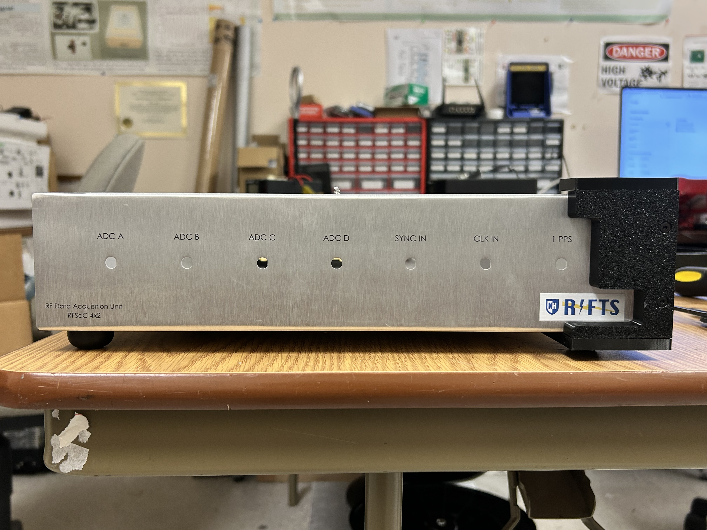
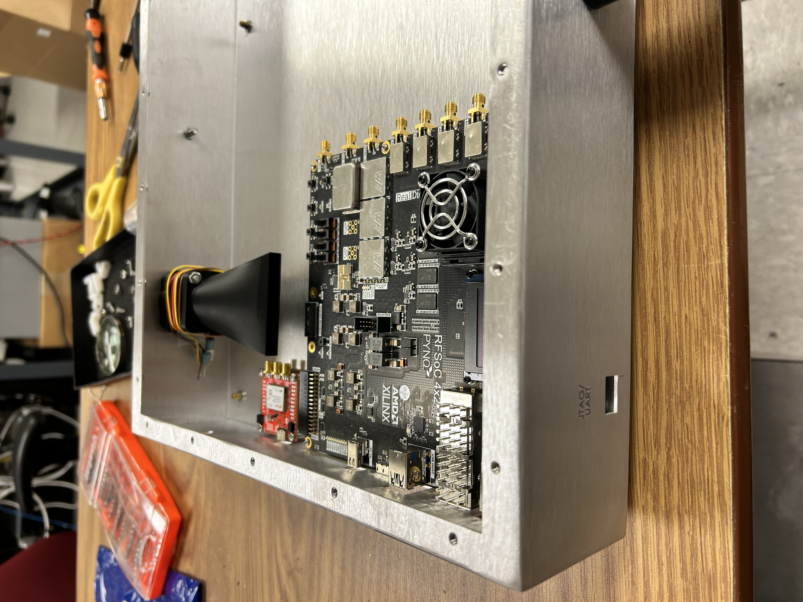
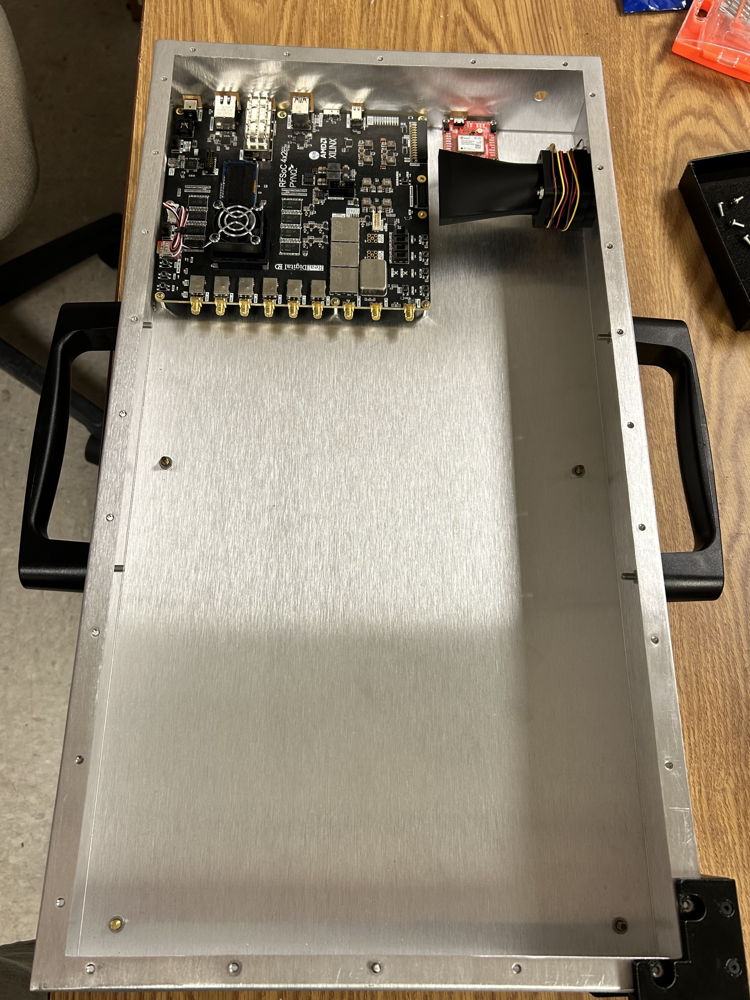
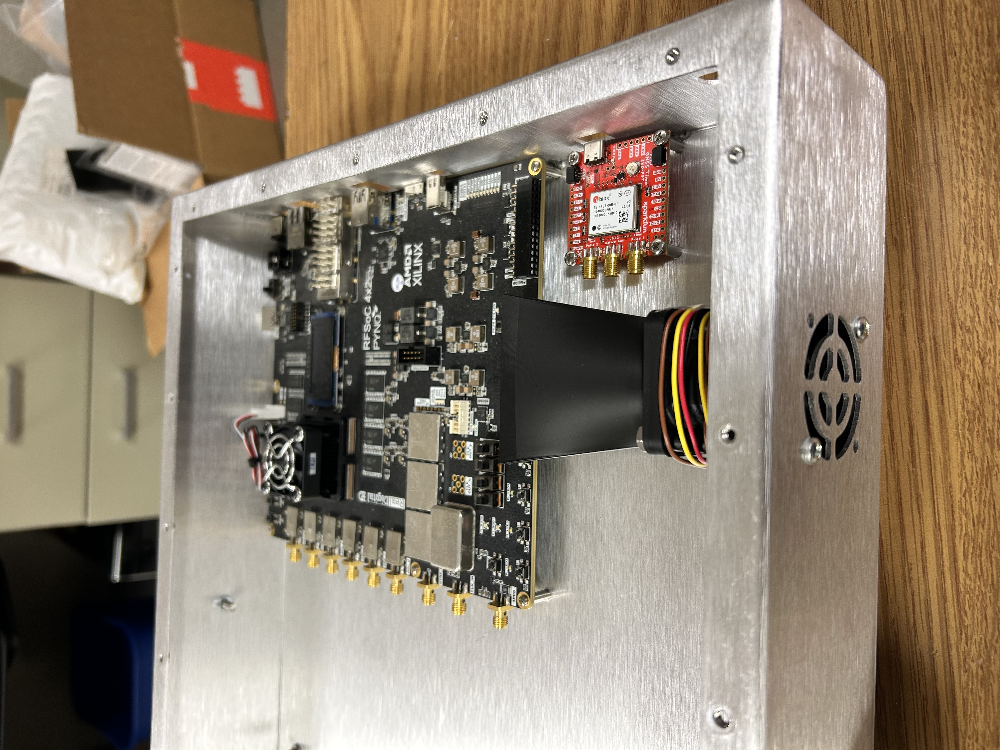

# Gallery

Click any photo below to open it full-size. Use the arrow keys or on-screen arrows to page through the rest of that section without returning to this page.

!!! note "Highly editable"
    This page is a starting scaffold — add, remove, or re-group images freely as photos come in. Each image needs:

    - `class="stack-item"` — required for the stacked layout
    - `style="--tx:Npx; --htx:Mpx; --rot:Xdeg; --z:Y;"` — collapsed offset, hover (fanned-out) offset, rotation, and stacking order
    - `data-gallery="group-name"` — images sharing a group name page through together in the click-through viewer

    To add a 5th+ photo to a stack, just increase `--tx`/`--htx`/decrease `--z` following the same pattern as the ones below.

---

## CAD Renders

<!-- Add CAD render images here, e.g.:
{: class="stack-item" style="--tx:0px; --htx:0px; --rot:-4deg; --z:5;" data-gallery="cad-renders" }
-->

*Renders pending upload.*

---

## Exterior Views

{: class="stack-item" style="--tx:0px; --htx:0px; --rot:-4deg; --z:5;" data-gallery="exterior-views" }

{: class="stack-item" style="--tx:14px; --htx:60px; --rot:3deg; --z:4;" data-gallery="exterior-views" }

{: class="stack-item" style="--tx:28px; --htx:120px; --rot:-3deg; --z:3;" data-gallery="exterior-views" }

*Front panel, side profile, and top cover of the completed enclosure.*

---

## Cooling System

{: class="stack-item" style="--tx:0px; --htx:0px; --rot:-4deg; --z:5;" data-gallery="cooling-system" }

*Side-mounted intake fan and overall airflow configuration.*

---

## Field & Lab Photos

<!-- Add real-world field/lab photos here, e.g.:
{: class="stack-item" style="--tx:0px; --htx:0px; --rot:-4deg; --z:5;" data-gallery="field-lab" }
-->

*Photos pending upload.*