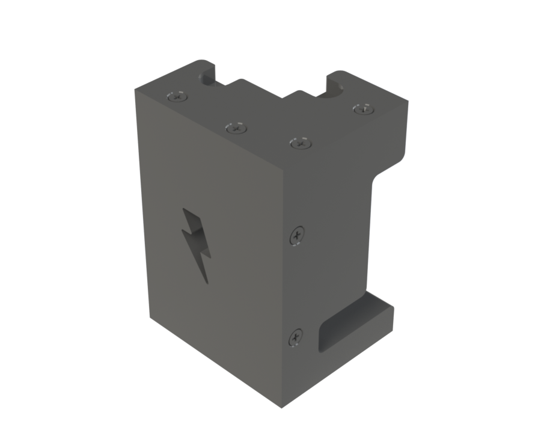
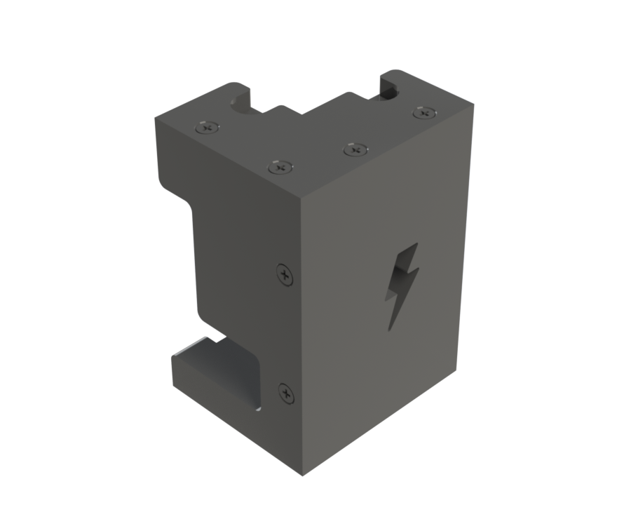
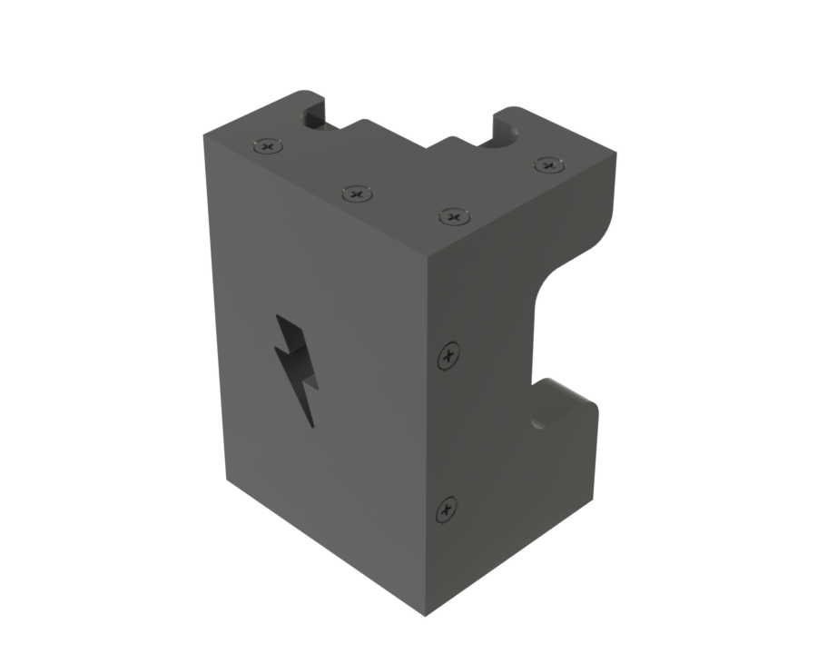
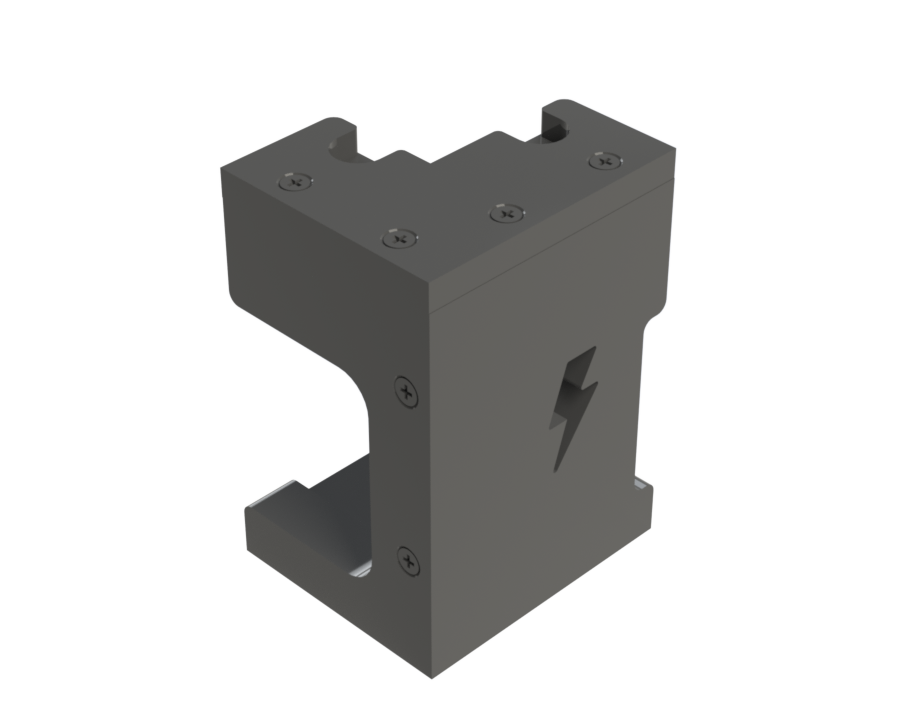

# RFSoC 4x2 TPU Corner Pad System

## Project Summary

| | |
|---|---|
| **Project** | RFSoC 4x2 TPU Corner Pad System |
| **Purpose** | Protective corner assemblies for portable enclosure handling and transportation |
| **Associated Platform** | RFSoC 4x2 Portable Field Enclosure |
| **Manufacturing Method** | FDM Additive Manufacturing |
| **Primary Material** | TPU |
| **Rigid Insert Material** | PLA Prototype / PETG Recommended |
| **Threaded Hardware** | M3 Brass Heat-Set Inserts |
| **Printer** | Bambu Lab A1 |
| **Status** | Complete |

---

## HD Renders

{: data-gallery="corner-pad-renders" }

{: data-gallery="corner-pad-renders" }

{: data-gallery="corner-pad-renders" }

{: data-gallery="corner-pad-renders" }

*Renders are shown in order from Corner Pad 1 to Corner Pad 4, left to right.*

<!-- Add more renders by appending additional image lines above, same pattern. -->

---

## Overview

The RFSoC 4x2 TPU Corner Pad System was developed specifically for the portable RIFTS RFSoC 4x2 enclosure to improve durability during transportation, handling, and field deployment.

Unlike the laboratory-oriented ZCU216 enclosure, the RFSoC 4x2 platform was designed for repeated transportation and operation outside of a controlled laboratory environment. The corner pad assemblies provide mechanical protection for the aluminum enclosure while improving stability when placed on uneven or irregular surfaces.

This system was developed exclusively for the RFSoC 4x2 portable enclosure — these assemblies are not used on the ZCU216 enclosure platform.

---

## Design Overview

Each enclosure corner uses a **unique corner pad assembly** designed to accommodate the specific geometry of that corner. The complete system consists of four separate corner assemblies, each built from four TPU sections.

Each assembly contains:

- Four TPU body sections.
- Ten custom rigid insert components.
- Ten M3 brass heat-set threaded inserts.
- Mechanical fasteners for final assembly.

The rigid insert components are bonded into dedicated pockets within the TPU sections. Because TPU is flexible and does not provide an ideal material for directly installing heat-set inserts, rigid printed inserts were incorporated to provide a more reliable threaded interface. The heat-set inserts are installed into the rigid insert components, allowing the TPU sections to be mechanically fastened together into a complete three-dimensional corner pad assembly — a modular construction that allows damaged sections to be replaced individually rather than requiring replacement of an entire corner assembly.

The corner pad assemblies were developed to:

- Protect enclosure corners during transportation and handling.
- Reduce impact forces transferred to the aluminum enclosure.
- Improve stability on uneven surfaces.
- Provide a high-friction interface between the enclosure and supporting surfaces.
- Improve long-term durability of the portable hardware platform.

### Material Selection

The protective corner sections were manufactured using Thermoplastic Polyurethane (TPU), selected for high impact resistance, flexibility under loading, abrasion resistance, high surface friction, and the ability to absorb mechanical shocks. Compared with rigid thermoplastics, TPU provides improved energy absorption and reduces the likelihood of transmitting impact forces directly into the aluminum enclosure.

The rigid insert components were originally manufactured using PLA to support rapid prototyping and design iteration. For future manufacturing, **PETG is recommended** because it provides improved toughness, increased impact resistance, better elevated-temperature performance, and reduced brittleness during repeated assembly.

### Heat-Set Insert Installation

The M3 brass heat-set inserts are installed into the rigid printed insert components. Recommended installation procedure:

1. Heat a soldering iron to approximately **230°C**.
2. Use a heat-set insert press attachment designed for soldering irons to maintain alignment during installation.
3. Insert the brass threaded insert into the prepared hole.
4. Ensure the **serrated face of the heat-set insert faces outward toward the opening of the hole** — the serrated surface should face upward/outward, not deeper into the printed insert.
5. Apply heat and gently press the insert into position until fully seated.

A suitable heat-set insert press attachment can be purchased commercially: [amazon.com](https://www.amazon.com/Vertical-Machine-Heat-Insertion-Threaded-Components/dp/B0DHKPHKJZ)

### Design Features

The completed corner pad assemblies provide full enclosure corner protection, replaceable modular construction, flexible impact absorption, increased friction against supporting surfaces, improved stability during transportation, and lightweight construction. The modular design allows individual TPU sections or rigid inserts to be replaced without recreating the entire assembly.

### Assembly Tutorial

<video controls style="width:100%; max-width:640px; border-radius:8px;">
  <source src="/hardware/tpu-pads/rfsoc-4x2-corner-pads/RIFTS_Corner_Pad_1_Assembly_Tutorial.mp4" type="video/mp4">
  Your browser does not support the video tag.
</video>

*SolidWorks walkthrough showing how the four TPU sections and rigid inserts assemble into one complete corner pad (shown using Corner Pad 1).*

### Installation Tutorial

<video controls style="width:100%; max-width:640px; border-radius:8px;">
  <source src="/hardware/tpu-pads/rfsoc-4x2-corner-pads/Corner_Pad_Installation_Tutorial.mp4" type="video/mp4">
  Your browser does not support the video tag.
</video>

*SolidWorks walkthrough showing how a completed corner pad assembly mounts to the RFSoC 4x2 enclosure (shown using Corner Pad 4). Not applicable to the ZCU216 enclosure, which does not use this corner pad system.*

!!! note
    Since all four pads assemble and install identically, both procedures shown apply equally regardless of which pad you're working with.

### Corner Numbering Diagram

*SolidWorks drawing labeling enclosure corners 1–4, showing which corner each pad is designed for.*

### Installed Assembly

<video controls style="width:100%; max-width:640px; border-radius:8px;">
  <source src="/hardware/tpu-pads/rfsoc-4x2-corner-pads/Corner_Pads_Rotate_View.mp4" type="video/mp4">
  Your browser does not support the video tag.
</video>

*SolidWorks rotating view showing all four corner pads installed on the RFSoC 4x2 enclosure — cross-reference with the numbering diagram above to identify which pad goes where.*

<!-- TODO: confirm final video filename once uploaded -->

---

## Downloads

Downloadable CAD and manufacturing files for all four unique corner assemblies (Section A, Section B, Section C, and Section D) and the shared rigid insert component.

!!! note
    Each bundle below packages that pad's four sections together with the rigid insert files in the matching format, so you only need to grab one zip per format instead of downloading each part individually. The Print Bundle (.zip) includes the `.3mf` for all four sections plus the rigid insert's `.3mf` as well.

| Corner Pad | SolidWorks Bundle (.zip) | Neutral Bundle (.zip) | STL Bundle (.zip) | Print Bundle (.zip) | Full Assembly (.SLDASM) |
|---|:---:|:---:|:---:|:---:|:---:|
| Corner Pad 1 | [:fontawesome-solid-file-zipper:](rfsoc-4x2-corner-pads/Corner_Pad_1/RIFTS_CornerPad_1_SLDPRT_Bundle.zip){: title="Corner Pad 1 — SLDPRT Bundle" } | [:fontawesome-solid-file-zipper:](rfsoc-4x2-corner-pads/Corner_Pad_1/RIFTS_CornerPad_1_STEP_Bundle.zip){: title="Corner Pad 1 — STEP Bundle" } | [:fontawesome-solid-file-zipper:](rfsoc-4x2-corner-pads/Corner_Pad_1/RIFTS_CornerPad_1_STL_Bundle.zip){: title="Corner Pad 1 — STL Bundle" } | [:fontawesome-solid-layer-group:](rfsoc-4x2-corner-pads/Corner_Pad_1/RIFTS_CornerPad_1_Print_Bundle.zip){: title="Corner Pad 1 — Print Bundle" } | [:fontawesome-solid-cubes:](rfsoc-4x2-corner-pads/Corner_Pad_1/RIFTS_Corner_Pad_1_Assembly.SLDASM){: title="Corner Pad 1 — Full Assembly" } |
| Corner Pad 2 | [:fontawesome-solid-file-zipper:](rfsoc-4x2-corner-pads/Corner_Pad_2/RIFTS_CornerPad_2_SLDPRT_Bundle.zip){: title="Corner Pad 2 — SLDPRT Bundle" } | [:fontawesome-solid-file-zipper:](rfsoc-4x2-corner-pads/Corner_Pad_2/RIFTS_CornerPad_2_STEP_Bundle.zip){: title="Corner Pad 2 — STEP Bundle" } | [:fontawesome-solid-file-zipper:](rfsoc-4x2-corner-pads/Corner_Pad_2/RIFTS_CornerPad_2_STL_Bundle.zip){: title="Corner Pad 2 — STL Bundle" } | [:fontawesome-solid-layer-group:](rfsoc-4x2-corner-pads/Corner_Pad_2/RIFTS_CornerPad_2_Print_Bundle.zip){: title="Corner Pad 2 — Print Bundle" } | [:fontawesome-solid-cubes:](rfsoc-4x2-corner-pads/Corner_Pad_2/RIFTS_Corner_Pad_2_Assembly.SLDASM){: title="Corner Pad 2 — Full Assembly" } |
| Corner Pad 3 | [:fontawesome-solid-file-zipper:](rfsoc-4x2-corner-pads/Corner_Pad_3/RIFTS_CornerPad_3_SLDPRT_Bundle.zip){: title="Corner Pad 3 — SLDPRT Bundle" } | [:fontawesome-solid-file-zipper:](rfsoc-4x2-corner-pads/Corner_Pad_3/RIFTS_CornerPad_3_STEP_Bundle.zip){: title="Corner Pad 3 — STEP Bundle" } | [:fontawesome-solid-file-zipper:](rfsoc-4x2-corner-pads/Corner_Pad_3/RIFTS_CornerPad_3_STL_Bundle.zip){: title="Corner Pad 3 — STL Bundle" } | [:fontawesome-solid-layer-group:](rfsoc-4x2-corner-pads/Corner_Pad_3/RIFTS_CornerPad_3_Print_Bundle.zip){: title="Corner Pad 3 — Print Bundle" } | [:fontawesome-solid-cubes:](rfsoc-4x2-corner-pads/Corner_Pad_3/RIFTS_Corner_Pad_3_Assembly.SLDASM){: title="Corner Pad 3 — Full Assembly" } |
| Corner Pad 4 | [:fontawesome-solid-file-zipper:](rfsoc-4x2-corner-pads/Corner_Pad_4/RIFTS_CornerPad_4_SLDPRT_Bundle.zip){: title="Corner Pad 4 — SLDPRT Bundle" } | [:fontawesome-solid-file-zipper:](rfsoc-4x2-corner-pads/Corner_Pad_4/RIFTS_CornerPad_4_STEP_Bundle.zip){: title="Corner Pad 4 — STEP Bundle" } | [:fontawesome-solid-file-zipper:](rfsoc-4x2-corner-pads/Corner_Pad_4/RIFTS_CornerPad_4_STL_Bundle.zip){: title="Corner Pad 4 — STL Bundle" } | [:fontawesome-solid-layer-group:](rfsoc-4x2-corner-pads/Corner_Pad_4/RIFTS_CornerPad_4_Print_Bundle.zip){: title="Corner Pad 4 — Print Bundle" } | [:fontawesome-solid-cubes:](rfsoc-4x2-corner-pads/Corner_Pad_4/RIFTS_Corner_Pad_4_Assembly.SLDASM){: title="Corner Pad 4 — Full Assembly" } |

[:fontawesome-solid-layer-group: Download All Pads (.3mf — 4 print plates, one per pad)](rfsoc-4x2-corner-pads/RIFTS_CornerPads_All_Print_Bundle.3mf){: .md-button :download}
[:fontawesome-solid-file-zipper: Download Rigid Insert Only (.zip — SLDPRT, STEP, .3mf)](rfsoc-4x2-corner-pads/RIFTS_CornerPad_Rigid_Insert_Bundle.zip){: .md-button :download}

### Notes

- Each **SolidWorks Bundle** (.zip) contains four `.SLDPRT` files (Sections A–D) plus the rigid insert `.SLDPRT`, and requires SolidWorks to open.
- Each **Neutral Bundle** (.zip) contains the same set in `.STEP` format, compatible with most CAD software — recommended if you don't have access to SolidWorks.
- Each **STL Bundle** (.zip) contains print-ready mesh geometry for all four sections plus the rigid insert, for slicing in any FDM slicer.
- Each **Print Bundle** (.zip) contains the `.3mf` files for all four sections plus the rigid insert, each preserving the validated print settings and slicer profile used for production. Opening them requires Bambu Studio.
- The **Full Assembly** (.SLDASM) is the complete assembled corner pad model (all four sections combined) and requires SolidWorks to open.
- **Download All Pads** is a single `.3mf` file containing four separate print plates, one per corner pad — load it in Bambu Studio and cycle through the plates to print the full set without opening four separate files.
- **Rigid Insert Only** provides just the shared insert component on its own, in every format, without needing to open a full pad bundle to get it.

---

## Commercial Sources

- **Heat-Set Insert Press:** Vertical Heat Insert Press Attachment for Soldering Iron — [amazon.com](https://www.amazon.com/Vertical-Machine-Heat-Insertion-Threaded-Components/dp/B0DHKPHKJZ)
- **M3 Brass Heat-Set Inserts:** *(link pending)*
- **M3 Countersunk Machine Screws:** *(link pending)*

---

## Manufacturing

The corner pad assemblies were manufactured using fused deposition modeling (FDM) additive manufacturing on a Bambu Lab A1 printer.

| Component | Material | Manufacturing Method |
|---|---|---|
| TPU corner sections | TPU | FDM 3D Printing |
| Rigid insert components | PLA Prototype / PETG Recommended | FDM 3D Printing |
| Threaded inserts | Brass M3 Heat-Set Inserts | Commercial Hardware |

---

## Revision History

| Revision | Date | Description |
|---|---|---|
| Rev A | July 2026 | Initial corner pad assembly documentation and archive release. |

---

## Credits

Mechanical design and documentation: **Joshua D'Addario**