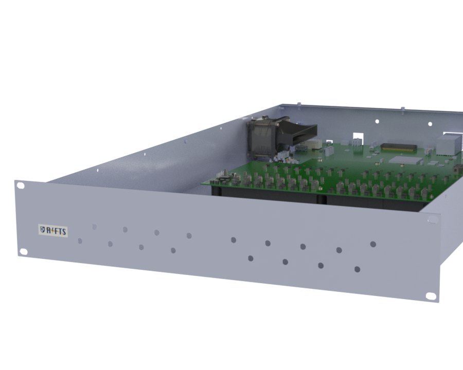
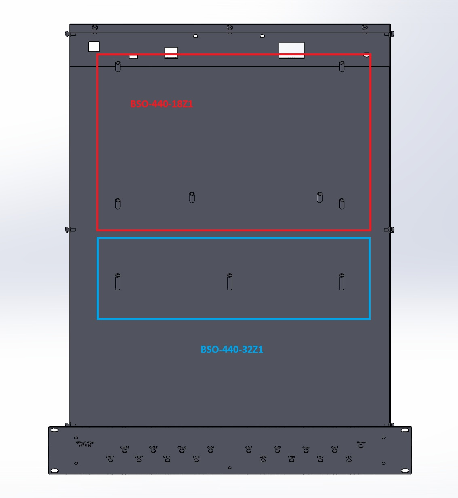
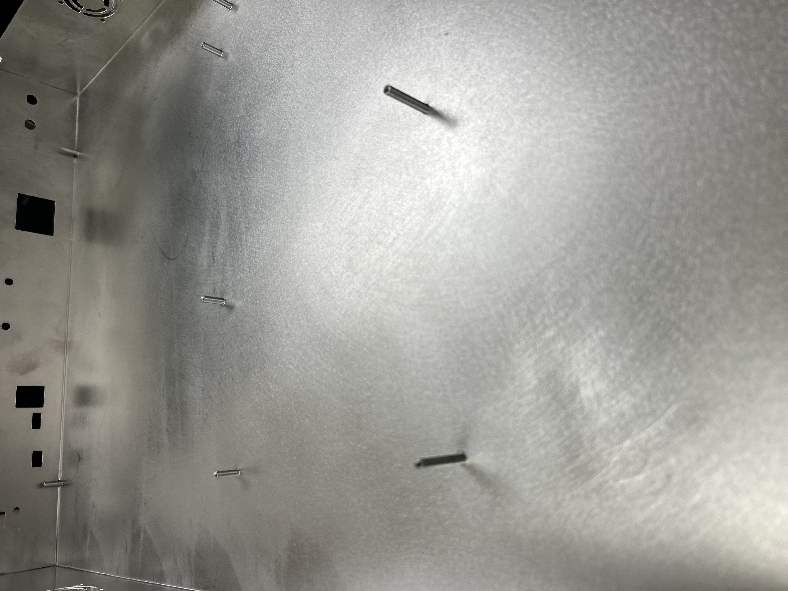

# ZCU216 RF Shielded Enclosure

## Project Summary

| | |
|---|---|
| **Project** | ZCU216 RF Shielded Enclosure |
| **Purpose** | EMI-shielded enclosure for laboratory integration of the AMD Xilinx ZCU216 RFSoC platform |
| **Platform** | AMD Xilinx ZCU216 RFSoC Development Board |
| **Application** | Radio Interferometer for Thunderstorm Studies (RIFTS) |
| **Manufacturer** | Protocase |
| **Material** | 5052 Aluminum |
| **Revision A Thickness** | 0.040 in (1.02 mm) |
| **Revision B Thickness** | 0.051 in (1.30 mm) |
| **Cooling** | Triple forced-air cooling (side-mounted intake and exhaust fans, plus a heatsink-mounted fan venting through the cover) |
| **Shielding Strategy** | Conductive aluminum enclosure with seam-welded construction, dense fastener spacing, and controlled aperture geometry |
| **Status** | Revision B Complete |
| **Related Hardware** | MIT Haystack RF Interface Board, Air Ducts, RFIB Support |

---

## HD Renders

.png){: data-gallery="zcu216-renders" }

.png){: data-gallery="zcu216-renders" }

.png){: data-gallery="zcu216-renders" }

{: data-gallery="zcu216-renders" }

<!-- {: data-gallery="zcu216-renders" } -->

<!-- Scroll strip — add more renders by appending additional image lines above, same pattern. -->

!!! note
    Where visible, these renders depict the enclosure fitted with the **Type B (Short) air duct system** — chosen for these renders simply because it looks cooler than the Type A variant. Both duct types are functionally interchangeable; see [Cooling Air Ducts](../ventilation/air-ducts.md) for details on both.

---

## Overview

The ZCU216 RF Shielded Enclosure was the first major enclosure platform developed for the University of New Hampshire's Radio Interferometer for Thunderstorm Studies (RIFTS) project.

The enclosure was designed to integrate the AMD Xilinx ZCU216 RFSoC development platform with the MIT Haystack RF Interface Board while providing mechanical protection, electromagnetic shielding, active cooling, and convenient laboratory operation within a standard 2U rack-mounted form factor.

Beyond simply housing electronics, this project established many of the mechanical design philosophies that would later influence the portable RFSoC 4x2 enclosure, including approaches to EMI mitigation, airflow management, manufacturability, and enclosure construction.

---

## Design Requirements

The enclosure was developed to satisfy several engineering requirements:

- Provide secure mechanical integration of the AMD Xilinx ZCU216 RFSoC platform.
- Integrate the MIT Haystack RF Interface Board within the same enclosure.
- Minimize electromagnetic emissions and susceptibility through conductive enclosure design.
- Support forced-air cooling for continuous laboratory operation.
- Package the system within a standard 2U rack-mounted form factor.
- Maintain accessibility to all required external interfaces.
- Allow repeatable assembly and servicing.

## Design Rationale

The enclosure was conceived as an RF engineering enclosure rather than simply a protective chassis. Several design decisions were driven specifically by electromagnetic compatibility (EMC) considerations.

### Conductive Construction

5052 aluminum was selected because it offers an excellent balance between electrical conductivity, manufacturability, corrosion resistance, structural performance, and cost. Unlike painted steel enclosures or polymer housings, the conductive aluminum body contributes directly to electromagnetic shielding performance.

### Mechanical Rigidity

Revision A demonstrated that although 0.040-inch aluminum was adequate structurally, increasing wall thickness would substantially improve enclosure rigidity. Revision B therefore increased the enclosure thickness to 0.051-inch aluminum.

The resulting enclosure is noticeably more rigid during transportation, assembly, and servicing while also providing modest improvements in low-frequency shielding performance.

### Seam Welding

One of the most significant improvements introduced in Revision B was seam welding. Continuous welded seams eliminate narrow gaps that can behave as unintended slot antennas.

Reducing these discontinuities improves overall shielding effectiveness while simultaneously increasing enclosure rigidity. This change became one of the most influential design improvements carried forward into later RIFTS hardware.

### Cooling Strategy

Thermal management is provided using two side-panel mounted fans in addition to a dedicated heatsink-mounted fan. The intake and exhaust fans are mounted directly to the enclosure side panels, establishing the primary airflow path through the enclosure. A third fan is mounted directly to the ZCU216's heatsink; heated air is drawn from the heatsink and pushed upward through a dedicated vent in the enclosure cover.

This arrangement produces effective, multi-path airflow through the enclosure while remaining straightforward to manufacture and service. This heatsink-mounted exhaust approach was later carried forward and expanded upon in the RFSoC 4x2 enclosure.

### EMI Shielding Philosophy

Rather than relying upon expensive conductive elastomer gaskets throughout the enclosure, the shielding strategy emphasized:

- Conductive aluminum construction
- Seam welding
- Controlled aperture geometry
- Dense fastener spacing around removable panels

This approach provided a practical balance between shielding performance and manufacturing cost.

---

## Mechanical Design

The enclosure consists of a welded aluminum chassis with a removable cover. Internal features include mounting provisions for:

- AMD Xilinx ZCU216 RFSoC Development Board
- MIT Haystack RF Interface Board
- Forced-air cooling hardware
- Standardized Protocase PEM hardware

The removable cover provides convenient service access while maintaining shielding continuity through closely spaced fasteners.

---

## Manufacturing

The enclosure was fabricated by Protocase using CNC sheet metal manufacturing techniques.

Standardized PEM hardware supplied by Protocase was incorporated throughout the design for board mounting and cover attachment. Although the enclosure was custom designed, the use of standardized manufacturing hardware simplified fabrication and ensured compatibility with Protocase manufacturing processes.

!!! note "Protocase Contact"
    UNH customer representative: [jhurd@protocase.com](mailto:jhurd@protocase.com)

---

## Design Evolution

### Revision A — August 2025

Revision A represented the first complete enclosure manufactured for the RIFTS project. This revision established:

- Overall enclosure dimensions
- Internal board layout
- Cooling architecture
- RF interface board integration
- Initial EMI shielding strategy
- Rack-mount configuration

Revision A successfully demonstrated the overall enclosure concept while identifying several opportunities for refinement.

### Revision B — December 2025

Revision B incorporated the lessons learned during evaluation of the original enclosure. Major improvements included:

- Increased aluminum thickness from 0.040 in to 0.051 in
- Seam-welded chassis construction
- Improved vent alignment directly above the heatsink-mounted fan
- Relocation of engraved panel labels above connector cutouts
- Increased overall enclosure rigidity

These improvements resulted in a noticeably more robust enclosure while simultaneously improving shielding performance and manufacturability. Revision B represents the final iteration of the ZCU216 enclosure.

---

## Engineering Notes

### PEM Hardware Selection

Protocase PEM hardware follows standardized dimensions. When selecting threaded standoffs, designers should note that the published dimensions correspond to the hardware **before installation** — part of each PEM becomes embedded within the sheet metal during installation, so the installed height will be shorter than the catalog dimension. Future enclosure designs should account for this reduction when selecting standoff lengths.

Standardized PEM standoffs were selected to mount the two PCBs housed within the enclosure — the AMD Xilinx ZCU216 development board and the MIT Haystack RF Interface Board — accounting for board thickness, required standoff height, and each board's mounting hole pattern:

| PCB | Standoff Part Number |
|-----|----------------------|
| AMD Xilinx ZCU216 | BSO-440-1871 |
| RF Interface Board | BSO-440-32Z1 |

The full Protocase standoff catalog is available at [protocase.com/products/components/standoff](https://www.protocase.com/products/components/standoff/) for reference when selecting standoffs for future revisions.

{: .hero-image }

*Standoff types used for the ZCU216 and RF Interface Board mounting.*

{: .hero-image }

*Standoff placement within the ZCU216 enclosure.*

#### Board Installation Video

<video controls style="width:100%; max-width:640px; border-radius:8px;">
  <source src="../media/ZCU216_Board_Installation_Tutorial.mp4" type="video/mp4">
  Your browser does not support the video tag.
</video>

*SolidWorks walkthrough showing installation of the AMD Xilinx ZCU216 development board and the MIT Haystack RF Interface Board onto their respective standoffs within the enclosure.*

<!-- TODO: confirm final video filename/path once uploaded -->

### Cooling Layout

Two fans are mounted directly to the enclosure side panels, providing the primary intake and exhaust path. A third fan is mounted directly to the ZCU216 heatsink and exhausts upward through a dedicated vent in the enclosure cover. This arrangement simplifies assembly while providing effective, multi-path airflow through the enclosure. Future modifications should preserve a clear airflow path for all three fans.

### Shielding Philosophy

See EMI Shielding Philosophy under Design Rationale above — the enclosure intentionally relies on conductive construction, welded seams, and fastener spacing rather than gaskets, trading some shielding performance for reduced manufacturing cost and assembly complexity.

### Serviceability

The removable cover provides straightforward access to all major internal components. Future enclosure modifications should preserve this accessibility whenever possible.

---

## Lessons Learned & Retrospective

Development of the ZCU216 enclosure produced several important engineering insights:

- Increasing enclosure wall thickness significantly improved structural rigidity without substantially increasing manufacturing complexity.
- Seam welding improved both enclosure stiffness and electromagnetic shielding by eliminating narrow conductive discontinuities that could behave as slot antennas.
- Small improvements in panel layout, such as centering ventilation openings and relocating engraved labels, noticeably improved overall usability and appearance.
- Simplified CAD models dramatically reduced SolidWorks assembly complexity while maintaining mechanical accuracy.
- Designing for manufacturability early in the CAD process reduced later manufacturing revisions.

The overall enclosure architecture has proven successful and would remain largely unchanged. If beginning the project again, seam-welded construction and thicker aluminum would be prioritized from the initial revision rather than introduced after the first production enclosure. Selective use of conductive EMI gaskets at removable panel interfaces would also be worth investigating, particularly at higher frequencies where dense fastener spacing alone becomes less effective.

Aside from these refinements, Revision B represents a well-balanced compromise between shielding performance, manufacturability, serviceability, and cost.

---

## Future Work

Although Revision B represents a mature enclosure design, several opportunities remain for future refinement:

- Evaluation of conductive EMI gasket materials for removable panels.
- Investigation of thicker aluminum construction comparable to the later RFSoC 4x2 enclosure.
- Additional quantitative shielding effectiveness measurements across a broader frequency range.
- Improved cable management features within the enclosure.
- Integration of future RF hardware platforms using the established enclosure architecture.

---

## Related Hardware

- MIT Haystack RF Interface Board (see Electronics Reference CAD Models)
- [Cooling Air Ducts](../ventilation/air-ducts.md)
- [RF Interface Board (RFIB) Support](../RFIB-support/rfib-support.md)

---

## Revision History

| Revision | Date | Description |
|-----------|------|-------------|
| Rev A | August 2025 | Initial enclosure manufactured and delivered by Protocase using 0.040 in 5052 aluminum. |
| Rev B | December 2025 | Increased wall thickness to 0.051 in, seam-welded construction, improved vent placement, updated panel labeling, and increased structural rigidity. |

---

## Credits

**Mechanical Design, CAD, and Documentation**
Joshua D'Addario — University of New Hampshire, Engineering Physics

**Project Support and Technical Guidance**
Dr. Ningyu Liu — University of New Hampshire, Principal Investigator, RIFTS
Stephen Horn — University of New Hampshire, Senior Member, RIFTS Research Team

**RF Hardware and Reference Designs**
AMD Xilinx — ZCU216 RFSoC Development Platform, RFSoC 4x2 Development Platform
Dr. Frank Lind, MIT Haystack Observatory — RF Interface Board

**Manufacturing**
[Protocase](https://www.protocase.com/) — custom precision sheet metal fabrication