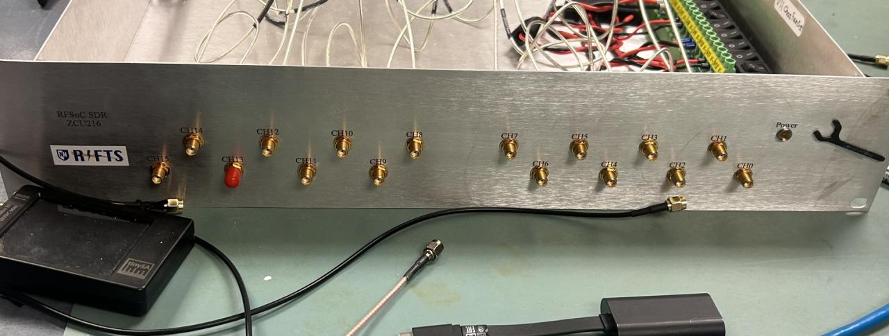

# Gallery

Click any photo below to open it full-size. Use the arrow keys or on-screen arrows to page through the rest of that section without returning to this page.

!!! note "Highly editable"
    This page is a starting scaffold — add, remove, or re-group images freely as photos come in. Each image needs:

    - `class="stack-item"` — required for the stacked layout
    - `style="--tx:Npx; --htx:Mpx; --rot:Xdeg; --z:Y;"` — collapsed offset, hover (fanned-out) offset, rotation, and stacking order
    - `data-gallery="group-name"` — images sharing a group name page through together in the click-through viewer

    To add a 5th+ photo to a stack, just increase `--tx`/`--htx`/decrease `--z` following the same pattern as the ones below.

---

## Complete Enclosure

{: class="stack-item" style="--tx:0px; --htx:0px; --rot:-4deg; --z:5;" data-gallery="complete-enclosure" }

{: class="stack-item" style="--tx:14px; --htx:60px; --rot:3deg; --z:4;" data-gallery="complete-enclosure" }

*Overall isometric view and front panel showing external interfaces and rack mounting features.*

---

## Internal Assembly

{: class="stack-item" style="--tx:0px; --htx:0px; --rot:-4deg; --z:5;" data-gallery="internal-assembly" }

*Internal view showing the AMD Xilinx ZCU216 RFSoC platform, MIT Haystack RF Interface Board, cooling hardware, and enclosure layout.*

---

## Rear Panel

{: class="stack-item" style="--tx:0px; --htx:0px; --rot:-4deg; --z:5;" data-gallery="rear-panel" }

*Rear panel detailing RF and electrical interfaces.*

---

## CAD Renders

<!-- Add CAD render images here, e.g.:
{: class="stack-item" style="--tx:0px; --htx:0px; --rot:-4deg; --z:5;" data-gallery="cad-renders" }
-->

*Renders pending upload.*