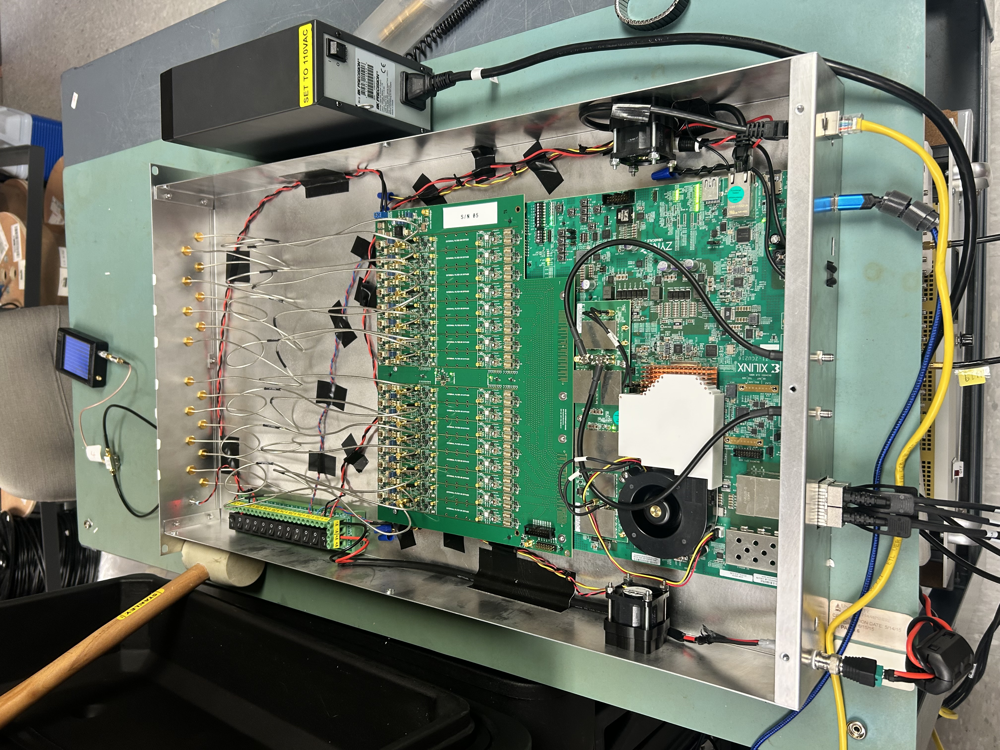

# RIFTS Hardware Design Archive

{: .hero-image }

Populated ZCU216 Rack-Mounted Enclosure (Rev A)
{: .figure-caption }

Mechanical design, validation testing, and engineering documentation for the **Radio Interferometer for Thunderstorm Studies (RIFTS)** project at the University of New Hampshire.

This site serves as the engineering archive for the mechanical hardware developed for RIFTS, preserving the design process, fabrication history, testing procedures, and engineering decisions behind each hardware platform.

Included documentation covers:

* Mechanical enclosure design
* Additively manufactured components
* CAD reference models
* Manufacturing files, print settings, and bills of materials
* Environmental validation testing
* HD renders, photos, and assembly/installation videos
* Engineering lessons learned

The goal of this archive is to provide a clear, maintainable reference for future hardware development, reproduction, and continued project support.

---

## What's In This Archive

### Hardware Platforms

:fontawesome-solid-suitcase:

**RFSoC 4x2 Portable Field Enclosure**

EMI-shielded aluminum enclosure engineered for field deployment, active cooling, and vehicle transport.

[View Page](hardware/rfsoc-4x2/overview.md){: .md-button }

:fontawesome-solid-server:

**ZCU216 Rack-Mount Enclosure**

Laboratory-oriented 2U rack-mounted enclosure for the ZCU216 development platform.

[View Page](hardware/zcu216/overview.md){: .md-button }

### Antenna Systems

:fontawesome-solid-satellite-dish:

**OmniLOG PRO 1030 N Antenna Mount**

Ground mounting system for the OmniLOG PRO 1030 N antenna, including mast and cylindrical housing.

[View Page](antenna/nav_2/antenna-overview.md){: .md-button }

### Supporting Hardware

:fontawesome-solid-fan:

**Cooling Air Ducts & Fans**

Shared FDM-printed airflow ducts and fan mounts used across both enclosure platforms.

[View Page](hardware/ventilation/air-ducts.md){: .md-button }

:fontawesome-solid-cubes:

**TPU Corner Pads**

Modular TPU corner protection system developed for the RFSoC 4x2 enclosure.

[View Page](hardware/tpu-pads/corner-pads-overview.md){: .md-button }

:fontawesome-solid-diagram-project:

**RF Pathway Reference Model**

Reverse-engineered mechanical reference model of the RFSoC 4x2's analog RF signal pathway.

[View Page](hardware/rfsoc-4x2-rf-pathway.md){: .md-button }

:fontawesome-solid-layer-group:

**RF Interface Board (RFIB) Support**

Two-piece structural bracket bridging the RFIB's mounting points to reduce board flex, with internal channels for cable routing.

[View Page](hardware/RFIB-support/rfib-support.md){: .md-button }

### Electronics Reference CAD Models

:fontawesome-solid-microchip:

**Electronics Reference CAD Catalog**

Catalog of mechanical reference models collected for enclosure integration throughout the project.

[View Page](electronics-cads/electronics-reference-cad-models.md){: .md-button }

---

## CAD and Manufacturing Files

Native CAD models, manufacturing files, and associated documentation are included throughout this archive.

Some third-party electronics CAD models are cataloged rather than directly downloadable, due to varying redistribution rights across manufacturers and collaborators — see the Electronics Reference CAD Models page for details on requesting those files.

---

## Engineering Archive Philosophy

This repository documents not only completed hardware, but also the engineering decisions and lessons learned that shaped each design. Each major subsystem includes:

* Design requirements
* Engineering rationale
* Manufacturing approach
* Validation testing
* Revision history
* Future improvement considerations

The objective is to preserve the complete engineering process rather than only the final manufactured hardware.

---

## Acknowledgements

This hardware was developed as part of the RIFTS project at the University of New Hampshire.

The author gratefully acknowledges the guidance, support, and contributions of the following individuals and organizations throughout the development of the hardware documented in this archive.

- **Dr. Ningyu Liu, University of New Hampshire** — Principal Investigator and faculty lead of the RIFTS project, providing project direction, technical guidance, and research oversight.

- **Stephen Horn, University of New Hampshire** — Senior member of the RIFTS research team whose technical expertise and assistance contributed to the development and integration of the project hardware.

- **Dr. Frank Lind, MIT Haystack Observatory** — RF Interface Board design and technical support for the RIFTS hardware platform.

- **Henry W. Ott** — author of *Electromagnetic Compatibility Engineering*, whose text was an invaluable reference throughout this project, particularly Chapter 6 on shielding.

Manufacturer and hardware vendor credits (AMD Xilinx, SparkFun Electronics, Aaronia, Protocase, and others) are listed on each individual hardware page.

---

## Maintainer

**Joshua D'Addario**

---

## Revision History

| Revision | Date      | Description                                              |
| -------- | --------- | --------------------------------------------------------- |
| Rev A    | July 2026 | Initial RIFTS hardware documentation archive.              |
| Rev B    | Aug 2026  | Repository cleaned up to contain only mkdocs source and its GitHub Actions deploy workflow; README rewritten to point to the live site rather than duplicate it. |