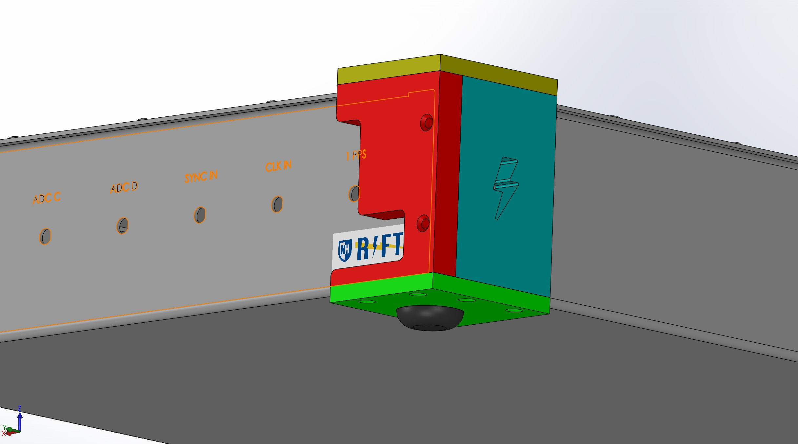

# Hardware Accessories

## Overview

This section contains supporting mechanical components developed for the RIFTS hardware platforms.

These components were designed to improve thermal performance, mechanical robustness, field usability, and system integration.

Included designs contain CAD models, manufacturing files, and additive manufacturing models where applicable.

---

# RFSoC 4x2 Accessories

The RFSoC 4x2 portable enclosure required several custom components to support field deployment and system integration.

---

# Cooling Air Ducts

Custom FDM-printed airflow components were developed to improve thermal management within the RFSoC 4x2 enclosure.

The air ducts direct airflow from the enclosure fans toward intended cooling regions, improving airflow management around heat-generating components.

## Manufacturing

- Manufacturing method:
  - FDM 3D printing

- Material:
  - PLA

- File formats:
  - STEP
  - STL

---

# TPU Corner Pads

Custom TPU corner pads were designed to improve mechanical protection and field usability of the RFSoC 4x2 portable enclosure.

The pads provide:

- Impact protection
- Improved stability on uneven surfaces
- Protection for enclosure corners during transport

## Manufacturing

- Manufacturing method:
  - FDM 3D printing

- Material:
  - TPU

- File formats:
  - STEP
  - STL

---

# RF Pathway CAD Model

The RFSoC 4x2 platform utilizes an integrated collection of analog RF components referred to as the RF pathway.

Unlike the ZCU216 platform, which utilized a dedicated RF interface board developed by MIT Haystack Observatory, the RFSoC 4x2 system integrated these RF components directly into the enclosure architecture.

A mechanical CAD representation of the RF pathway was created to support enclosure integration and documentation.

Because complete manufacturer CAD was unavailable, the assembly was reconstructed manually from available references.

The resulting model represents the best available mechanical approximation for design documentation purposes.

---

# ZCU216 Accessories

Supporting components developed for the ZCU216 enclosure are documented within this section.

Additional accessory documentation will be added as applicable.

---

# File Organization

Each accessory folder contains:

- README documentation
- Native CAD files where available
- STEP exports
- STL files for additive manufacturing components
- Manufacturing notes

---

# Revision History

| Revision | Date | Description |
|----------|------|-------------|
| Rev A | July 2026 | Initial accessory archive documentation. |

---

# Credits

Mechanical design and documentation:
- Joshua D'Addario