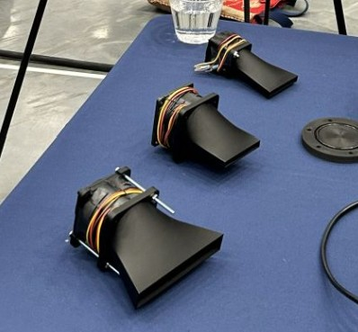
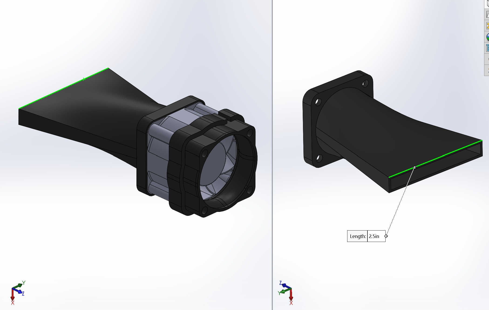
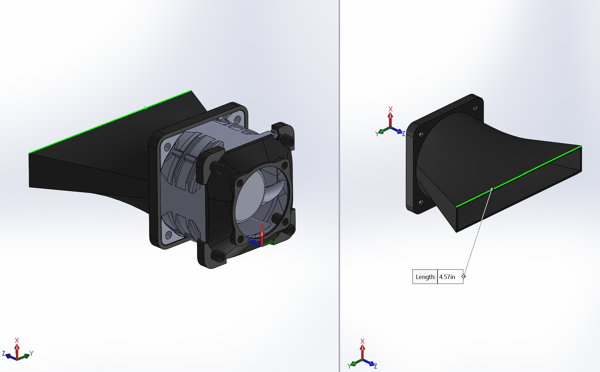

# Cooling Air Ducts

## Overview

The RIFTS cooling air ducts are custom airflow management components developed to improve thermal performance within the project enclosure platforms.

These components were designed to direct fan-generated airflow toward intended cooling regions, improving heat removal from internally mounted electronics.

The cooling air duct system was implemented across multiple RIFTS hardware platforms:

- ZCU216 rack-mounted enclosure
- RFSoC 4x2 portable field enclosure

---

## Design Purpose

Active thermal management was required due to the significant heat generation of the RF electronics contained within the RIFTS enclosures.

Rather than relying solely on unrestricted enclosure airflow, custom ducting was developed to:

- Improve airflow directionality
- Reduce bypass airflow
- Increase effectiveness of intake and exhaust fans
- Provide repeatable thermal performance between enclosure builds

---

## Design Features

The cooling duct assemblies provide:

- Directed airflow paths from enclosure fans
- Mechanical integration with existing enclosure geometry
- Lightweight construction
- Rapid iteration through additive manufacturing

The designs were developed around the available enclosure space, fan locations, and internal hardware arrangement.

The two duct designs are designated as:

- Cooling Air Duct Type A
- Cooling Air Duct Type B

These names describe the component geometries and do not indicate a fixed installation orientation or enclosure location.

---

## Gallery

### CAD Models

Cooling Air Duct Type A CAD model.

Cooling Air Duct Type B CAD model.

---

### Installed Components

Installed cooling duct assemblies within the enclosure.

---

## Manufacturing

The cooling air ducts were manufactured using fused deposition modeling (FDM) additive manufacturing.

### Manufacturing Details

- Manufacturing method:
  - FDM 3D printing

- Material:
  - PLA

- File formats:
  - SLDPRT
  - STEP
  - STL

PLA was selected for rapid prototyping, dimensional accuracy, and ease of fabrication.

---

## Associated Hardware Platforms

### ZCU216 Enclosure

The cooling ducts support thermal management of the laboratory-oriented ZCU216 enclosure.

The ducting system directs airflow generated by the enclosure fans through intended cooling paths.

---

### RFSoC 4x2 Portable Enclosure

The cooling ducts support thermal management during mobile field deployment.

The ducting system was integrated alongside the portable enclosure architecture, which includes:

- Intake fan
- Exhaust fan
- RFSoC 4x2 heatsink assembly
- Field-deployment mechanical constraints

---

## File Downloads

The following files are available for download.

---

## CAD Files

### SolidWorks Native Files

Editable SolidWorks part files:

- [Cooling Air Duct Type A (.SLDPRT)](RIFTS_Cooling_Air_Duct_Type_A.SLDPRT)

- [Cooling Air Duct Type B (.SLDPRT)](RIFTS_Cooling_Air_Duct_Type_B.SLDPRT)

---

### STEP Export Files

Universal CAD exchange files:

- [Cooling Air Duct Type A (.STEP)](RIFTS_Cooling_Air_Duct_Type_A.STEP)

- [Cooling Air Duct Type B (.STEP)](RIFTS_Cooling_Air_Duct_Type_B.STEP)

---

## 3D Printing Files

STL files intended for FDM manufacturing:

- [Cooling Air Duct Type A (.STL)](RIFTS_Cooling_Air_Duct_Type_A.stl)

- [Cooling Air Duct Type B (.STL)](RIFTS_Cooling_Air_Duct_Type_B.stl)

---

## Recommended Usage

- Use SolidWorks (`.SLDPRT`) files for future design modifications.
- Use STEP files for integration into larger CAD assemblies.
- Use STL files for direct fabrication.

---

## Revision History

| Revision | Date | Description |
|----------|------|-------------|
| Rev A | July 2026 | Initial cooling air duct documentation and archive release. |

---

## Credits

Mechanical design and documentation:

**Joshua D'Addario**