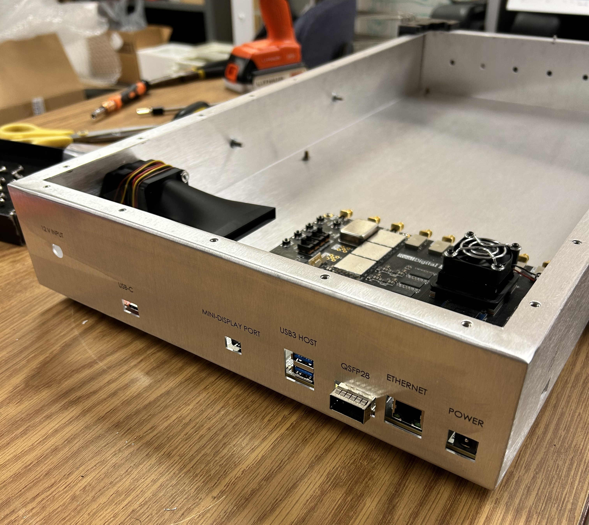

# RFSoC 4x2 Portable Field Enclosure

## Overview

The RFSoC 4x2 enclosure was developed as a portable field-deployable hardware platform for the RIFTS project at the University of New Hampshire.

Unlike the earlier ZCU216 enclosure, which was designed primarily for laboratory integration in a 2U rack-mounted form factor, the RFSoC 4x2 enclosure was designed for mobile lightning measurement campaigns.

The enclosure provides mechanical protection, electromagnetic shielding, thermal management, and portability for transportation by vehicle and deployment in field environments.

---

## Design Features

- Portable field-deployment form factor
- 5052 aluminum sheet metal construction
  - 0.064 inch material thickness
- Integrated carrying handles
- Rubber feet for operation on rugged terrain or benchtop surfaces
- Electromagnetic shielding considerations
- Active thermal management
- Access provisions for RFSoC 4x2 interfaces
- Integrated RF pathway hardware

---

## Gallery

### Complete Enclosure

### Exterior Views

### Cooling System

---

## Thermal Management

The RFSoC 4x2 enclosure uses an active cooling system consisting of two fans:

- Intake fan
- Exhaust fan

The exhaust fan is mounted directly to the heatsink assembly included with the RFSoC 4x2 development board. Hot air is directed away from the heatsink and exhausted through a dedicated enclosure vent.

Additional airflow management components were developed specifically for this enclosure:

- PLA FDM-printed fan air ducts
- Custom internal airflow routing features

Associated CAD and STL files are included within the enclosure accessories archive.

---

## Design Rationale

### RFSoC 4x2 Mounting Strategy

The original enclosure concept followed the ZCU216 approach, where the development board was intended to be mounted flush and centered against the rear enclosure wall.

During integration, this approach was modified due to the location of the RFSoC 4x2 JTAG/UART interface located on the side of the board.

To maintain accessibility to required interfaces, the RFSoC 4x2 was repositioned flush into a corner of the enclosure. This allowed openings to be incorporated into both:

- the rear enclosure panel
- the side enclosure panel

This configuration provided access to necessary board interfaces while maintaining a compact enclosure footprint.

---

## RF Pathway Integration

Unlike the ZCU216 platform, which utilized an RF interface board developed by MIT Haystack Observatory, the RFSoC 4x2 platform utilizes an integrated collection of analog RF components referred to as the RF pathway.

A CAD representation of the RF pathway assembly was created for mechanical integration and documentation purposes.

Because vendor CAD was not available for the complete assembly, the model was reconstructed to the highest accuracy possible from available references.

---

## Directory Contents

### Board CAD

Contains reference CAD models for the RFSoC 4x2 platform.

---

### Enclosure CAD

Contains the final enclosure CAD model.

Format:
- STEP

---

### Associated Components

Additional components developed for this enclosure include:

- TPU FDM-printed corner pads
- PLA FDM-printed air ducts
- RF pathway CAD model

Associated STEP and STL files are included within the hardware archive.

---

### Manufacturing Files

Contains fabrication files used for enclosure production.

Manufacturer:
- Protocase

Format:
- Protocase PDA

---

## Manufacturing Notes

The RFSoC 4x2 enclosure was manufactured by Protocase using 5052 aluminum sheet metal.

A second enclosure order was required due to a manufacturing compliance issue with the first delivered enclosure.

The issue involved improperly installed PEM fasteners used to secure the removable cover. The installed PEMs prevented proper removal of the cover using the intended screw-fastened assembly.

The replacement enclosure was manufactured with corrected PEM installation.

---

## Revision History

| Revision | Date | Description |
|----------|------|-------------|
| Rev A | 2026 | Initial manufactured RFSoC 4x2 portable enclosure design. Replacement enclosure manufactured due to PEM installation issue. |

---

## Credits

Mechanical design and documentation:
- Joshua D'Addario

Hardware platform:
- AMD Xilinx RFSoC 4x2 development platform