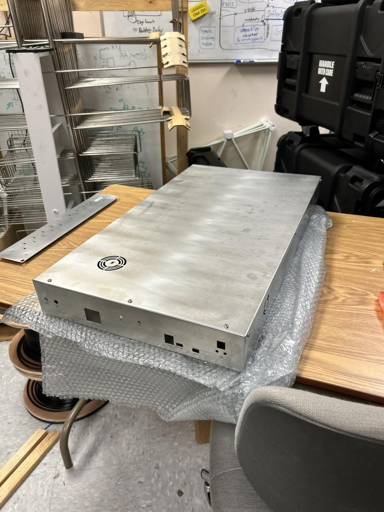
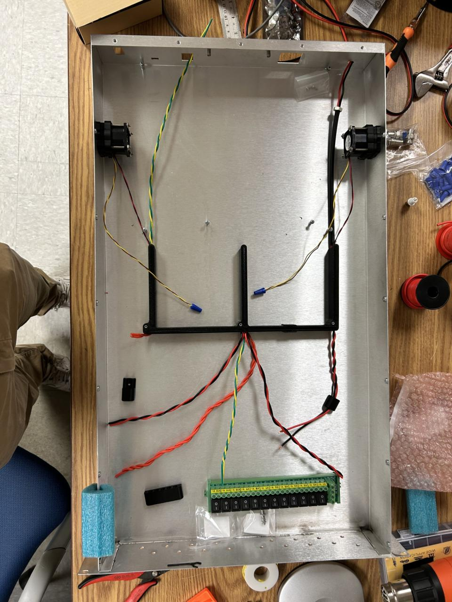
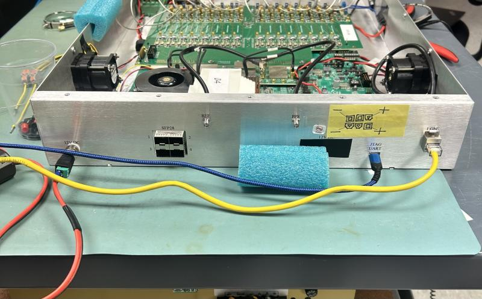

# ZCU216 RF Shielded Enclosure

---

# Project Summary

| | |
|---|---|
| **Project** | ZCU216 RF Shielded Enclosure |
| **Purpose** | EMI-shielded enclosure for laboratory integration of the AMD Xilinx ZCU216 RFSoC platform |
| **Platform** | AMD Xilinx ZCU216 RFSoC Development Board |
| **Application** | Radio Interferometer for Thunderstorm Studies (RIFTS) |
| **Manufacturer** | Protocase |
| **Material** | 5052 Aluminum |
| **Revision A Thickness** | 0.040 in (1.02 mm) |
| **Revision B Thickness** | 0.051 in (1.30 mm) |
| **Cooling** | Dual forced-air cooling (side-mounted intake and exhaust fans) |
| **Shielding Strategy** | Conductive aluminum enclosure with seam-welded construction, dense fastener spacing, and controlled aperture geometry |
| **Status** | Revision B Complete |
| **Related Hardware** | MIT Haystack RF Interface Board, RFSoC 4x2 Enclosure, Air Ducts |

---

# Overview

The ZCU216 RF Shielded Enclosure was the first major mechanical hardware platform developed for the University of New Hampshire's **Radio Interferometer for Thunderstorm Studies (RIFTS)** project.

The enclosure was designed to integrate the AMD Xilinx ZCU216 RFSoC development platform with the MIT Haystack RF Interface Board while providing mechanical protection, electromagnetic shielding, active cooling, and convenient laboratory operation within a standard 2U rack-mounted form factor.

Beyond simply housing electronics, this project established many of the mechanical design philosophies that would later influence the portable RFSoC 4x2 enclosure, including approaches to EMI mitigation, airflow management, manufacturability, and enclosure construction.

---

# Design Requirements

The enclosure was developed to satisfy several engineering requirements:

- Provide secure mechanical integration of the AMD Xilinx ZCU216 RFSoC platform.
- Integrate the MIT Haystack RF Interface Board within the same enclosure.
- Minimize electromagnetic emissions and susceptibility through conductive enclosure design.
- Support forced-air cooling for continuous laboratory operation.
- Package the system within a standard 2U rack-mounted form factor.
- Maintain accessibility to all required external interfaces.
- Allow repeatable assembly and servicing.

---

# Design Rationale

The enclosure was conceived as an RF engineering enclosure rather than simply a protective chassis.

Several design decisions were driven specifically by electromagnetic compatibility (EMC) considerations.

### Conductive Construction

5052 aluminum was selected because it offers an excellent balance between electrical conductivity, manufacturability, corrosion resistance, structural performance, and cost.

Unlike painted steel enclosures or polymer housings, the conductive aluminum body contributes directly to electromagnetic shielding performance.

---

### Mechanical Rigidity

Revision A demonstrated that although 0.040-inch aluminum was adequate structurally, increasing wall thickness would substantially improve enclosure rigidity.

Revision B therefore increased the enclosure thickness to 0.051-inch aluminum.

The resulting enclosure is noticeably more rigid during transportation, assembly, and servicing while also providing modest improvements in low-frequency shielding performance.

---

### Seam Welding

One of the most significant improvements introduced in Revision B was seam welding.

Continuous welded seams eliminate narrow gaps that can behave as unintended slot antennas.

Reducing these discontinuities improves overall shielding effectiveness while simultaneously increasing enclosure rigidity.

This change became one of the most influential design improvements carried forward into later RIFTS hardware.

---

### Cooling Strategy

Thermal management is provided using two internally mounted fans.

Both the intake and exhaust fans are mounted directly to the enclosure side panels.

This arrangement produces a straightforward airflow path through the enclosure while simplifying manufacturing and maintenance.

Unlike the later RFSoC 4x2 enclosure, neither fan is mounted directly to the RFSoC heatsink.

---

### EMI Shielding Philosophy

Rather than relying upon expensive conductive elastomer gaskets throughout the enclosure, the shielding strategy emphasized:

- conductive aluminum construction
- seam welding
- controlled aperture geometry
- dense fastener spacing around removable panels

This approach provided a practical balance between shielding performance and manufacturing cost.

---

# Key Engineering Improvements

| Revision | Major Improvements |
|-----------|--------------------|
| **Rev A (August 2025)** | Initial enclosure design establishing overall architecture, board integration, cooling layout, and shielding strategy. |
| **Rev B (December 2025)** | Increased wall thickness, seam-welded construction, improved vent placement, relocated panel labels, and increased overall structural rigidity. |

---

# Mechanical Design

The enclosure consists of a welded aluminum chassis with a removable cover.

Internal features include mounting provisions for:

- AMD Xilinx ZCU216 RFSoC Development Board
- MIT Haystack RF Interface Board
- Forced-air cooling hardware
- Standardized Protocase PEM hardware

The removable cover provides convenient service access while maintaining shielding continuity through closely spaced fasteners.

---

# Gallery

## Complete Enclosure

Overall isometric view of the completed enclosure.

---

Front panel showing external interfaces and rack mounting features.

---

## Internal Assembly

Internal view showing the AMD Xilinx ZCU216 RFSoC platform, MIT Haystack RF Interface Board, cooling hardware, and enclosure layout.

---

## Rear Panel

Rear panel detailing RF and electrical interfaces.

---

# Directory Contents

The repository preserves both the final enclosure design and the reference models used throughout development.

## Board CAD

Reference CAD models used during enclosure development.

### AMD Xilinx ZCU216 Development Board

- `AMD_Xilinx_ZCU216_Board.SLDPRT`

Manufacturer-supplied CAD model of the AMD Xilinx ZCU216 RFSoC development platform.

---

### MIT Haystack RF Interface Board

- `MIT_Haystack_RF_Interface_Board.SLDPRT`

High-fidelity CAD model of the RF Interface Board developed by Frank Lind at MIT Haystack Observatory.

---

### Simplified RF Interface Board

- `MIT_Haystack_RF_Interface_Board_Simplified.SLDPRT`

Simplified reference model developed specifically for enclosure design.

Only mechanically significant geometry was retained in order to improve SolidWorks performance while preserving:

- External dimensions
- Connector locations
- Mounting interfaces
- Overall board envelope

The simplified model is recommended for future enclosure development unless detailed internal geometry is required.

---

## Enclosure CAD

The completed enclosure model is provided in neutral CAD format.

Available formats:

- STEP

---

## Manufacturing Files

Manufacturing documentation includes the original fabrication package used for production by Protocase.

Available formats:

- Protocase PDA

These files preserve the exact enclosure geometry submitted for manufacturing and may be used for future revisions or reproduction.

---

# Manufacturing Notes

The enclosure was fabricated by **Protocase** using CNC sheet metal manufacturing techniques.

Standardized PEM hardware supplied by Protocase was incorporated throughout the design for board mounting and cover attachment.

Although the enclosure was custom designed, the use of standardized manufacturing hardware simplified fabrication and ensured compatibility with Protocase manufacturing processes.

---

# CAD Model Notes

Several reference models are intentionally provided in both original and simplified forms.

The simplified models remove unnecessary cosmetic and internal features while preserving all mechanically significant geometry.

Using simplified reference models substantially improves CAD performance, rebuild times, and assembly responsiveness without affecting enclosure design accuracy.

---

# Design Evolution

## Revision A — August 2025

Revision A represented the first complete enclosure manufactured for the RIFTS project.

This revision established:

- Overall enclosure dimensions
- Internal board layout
- Cooling architecture
- RF interface board integration
- Initial EMI shielding strategy
- Rack-mount configuration

Revision A successfully demonstrated the overall enclosure concept while identifying several opportunities for refinement.

---

## Revision B — December 2025

Revision B incorporated the lessons learned during evaluation of the original enclosure.

Major improvements included:

- Increased aluminum thickness from **0.040 in** to **0.051 in**
- Seam-welded chassis construction
- Improved vent alignment directly above the exhaust fan
- Relocation of engraved panel labels above connector cutouts
- Increased overall enclosure rigidity

These improvements resulted in a noticeably more robust enclosure while simultaneously improving shielding performance and manufacturability.

Revision B represents the final iteration of the ZCU216 enclosure.

---

# Historical Context

The ZCU216 enclosure served as the foundation for subsequent RIFTS hardware development.

Many design concepts introduced during this project—including shielding strategies, cooling philosophy, enclosure construction techniques, and manufacturing practices—directly influenced the development of the later RFSoC 4x2 field enclosure.

The evolution from Revision A to Revision B also demonstrated the value of iterative hardware development, where practical experience informed meaningful engineering improvements in later designs.

---

# Lessons Learned

Development of the ZCU216 enclosure produced several important engineering insights.

- Increasing enclosure wall thickness significantly improved structural rigidity without substantially increasing manufacturing complexity.
- Seam welding improved both enclosure stiffness and electromagnetic shielding by eliminating narrow conductive discontinuities that could behave as slot antennas.
- Small improvements in panel layout, such as centering ventilation openings and relocating engraved labels, noticeably improved overall usability and appearance.
- Simplified CAD models dramatically reduced SolidWorks assembly complexity while maintaining mechanical accuracy.
- Designing for manufacturability early in the CAD process reduced later manufacturing revisions.

---

# Engineering Notes

## PEM Hardware Selection

Protocase PEM hardware follows standardized dimensions.

When selecting threaded standoffs, designers should note that the published dimensions correspond to the hardware **before installation**.

Because part of each PEM becomes embedded within the sheet metal during installation, the installed height will be shorter than the catalog dimension.

Future enclosure designs should account for this reduction when selecting standoff lengths.

---

## Cooling Layout

Both cooling fans are mounted directly to the enclosure side panels.

This arrangement simplifies assembly while providing effective airflow through the enclosure.

Future modifications should preserve a clear intake-to-exhaust airflow path.

---

## Shielding Philosophy

The enclosure intentionally relies upon conductive construction, welded seams, controlled aperture geometry, and dense fastener spacing rather than extensive use of conductive elastomer gaskets.

While conductive gaskets can further improve shielding performance, they also introduce additional manufacturing cost and assembly complexity.

---

## Serviceability

The removable cover provides straightforward access to all major internal components.

Future enclosure modifications should preserve this accessibility whenever possible.

---

# Future Work

Although Revision B represents a mature enclosure design, several opportunities remain for future refinement.

Potential improvements include:

- Evaluation of conductive EMI gasket materials for removable panels.
- Investigation of thicker aluminum construction comparable to the later RFSoC 4x2 enclosure.
- Additional quantitative shielding effectiveness measurements across a broader frequency range.
- Improved cable management features within the enclosure.
- Integration of future RF hardware platforms using the established enclosure architecture.

---

# Retrospective

The overall enclosure architecture has proven successful and would remain largely unchanged.

If beginning the project again, I would prioritize seam-welded construction and thicker aluminum from the initial revision rather than introducing those improvements after the first production enclosure.

I would also investigate the selective use of conductive EMI gaskets at removable panel interfaces to further improve shielding effectiveness, particularly at higher frequencies where dense fastener spacing alone becomes less effective.

Aside from these refinements, Revision B represents a well-balanced compromise between shielding performance, manufacturability, serviceability, and cost.

---

# Related Documentation

- [RFSoC 4x2 Enclosure](../rfsoc-4x2/README.md)
- [Air Ducts](../../Accessories/Air_Ducts/README.md)
- [RF Pathway](../../Accessories/RF_Pathway/README.md)

---

# Revision History

| Revision | Date | Description |
|-----------|------|-------------|
| Rev A | August 2025 | Initial enclosure manufactured and delivered by Protocase using 0.040 in 5052 aluminum. |
| Rev B | December 2025 | Increased wall thickness to 0.051 in, seam-welded construction, improved vent placement, updated panel labeling, and increased structural rigidity. |

---

# Credits

## Mechanical Design, CAD, and Documentation

**Joshua D'Addario**

University of New Hampshire

Engineering Physics

---

## RF Hardware

**AMD Xilinx**

ZCU216 RFSoC Development Platform

---

**Frank Lind**

MIT Haystack Observatory

RF Interface Board

---

## Manufacturing

**Protocase**

Custom precision sheet metal fabrication.
